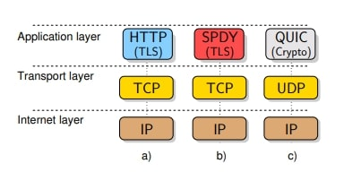
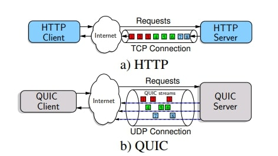
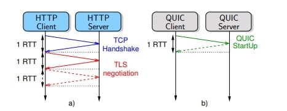

## Cover

<h3 align="center">
    <b>Praktikum Keamanan Jaringan</b> 
    HTTP Over UDP / QUIC
</h3>
 

  

 

    Dosen Pembimbing: 
    Ferry Astika Saputra, S.T., M.Sc.

 

    Disusun Oleh: 
    Septiana Dyah Anissawati (3122640031)

 

    <b>
        KELAS D4 LJ IT B  
        JURUSAN D4 LJ TEKNIK INFORMATIKA B 
        DEPARTEMEN TEKNIK INFORMATIKA DAN KOMPUTER   
        POLITEKNIK ELEKTRONIKA NEGERI SURABAYA  
        2023
    </b>

 

## Laporan

[VIDEO DEMO](https://drive.google.com/drive/folders/1Dp0PYbuwKfM34pbiMiGeTPeclaHBcVvL?usp=sharing)

## HTTP Over UDP / QUIC

Dibangun diatas UDP, protokol QUIC bari-baru ini dibakukan dengan tujuan utamanya menggantikan model TCP plus TLS plus HTTP/2 secara bertahap. Dalam HTTP/3 dirancang untuk mengekploitasi fitur QUIC, termasuk pengurangan waktu pembuatan koneksi, multiplexing tanpa pemblokiran garis depan, keamanan end-to-end yang selalu dienkripsi, dan lain-lain. Tujuan utama dari protokol lapisan transport QUIC adalah untuk meningkatkan kinerja karena meskipun model HTTP plus TLS melayani web dengan baik sekitar 15 tahun, menjadi jelas bahwa itu tidak dapat lagi mempertahankan permintaan bandwidth dan peka latensi yang muncul. Aplikasi web, misalnya salah satu masalah utama HTTP/1.1 adalah pemblokiran Head-of-Line (HoL) HTTP, yang menyebabkan peningkatan penundaan respons ketika permintaan HTTP dapat menunda semua permintaan sub-urutan dalam koneksi TCP yang sama.

Gambar 1 HTTP, SPDY, dan QUIC

Untuk meingkatkan kinerja HTTP, pada thaun 2009 Google mengumumkan SPDY, yang menjadi dasar spesifikasi HTTP/2 pada tahun 2015. HTTP/2 memecahkan pemblokiran HTTP HoL dan memperkenalkan bermacam-macam perbaikan lainnya juga, termasuk kompresi header, multiplexing, dan dorongan server. Namun pemblokiran HoL masih dimungkinkan dalam HTTP/2, tetapi kali ini pada tingkat TCP, dimana paket TCP yang hilang atau tertiggal dapat menunda semua paket berikutnya.

Menanggapi masalah ini, Google memperkenalkan QUIC yang dirancang dari bawah ke atas pada tahun 2012, yang merupakan protokol transpor terenkripsi penuh, multipleks, dan latensi rendah melalui UDP, menargetkan terutama untuk meningkatkan kinerja lalu lintas HTTPS. Pada bulan Mei 2021, IETF menstandarkan QUIC dalam RFC 9000, dan juga ditentukan dalam RFC 9001 cara TLS 1.3 akan bertindak sebagai komponen keamanan QUIC. Khususnya koneksi HTTP/3 direalisasikan melalui QUIC. Pada Oktober 2020, Facebook mengumumkan bahwa "lebih dari 75% lalu lintas internet menggunakan QUIC dan HTTP/3". 

## The QUIC Protocol

Koneksi Internet UDP cepat (QUIC) adalah protokol eksperimental yang diusulkan oleh Google dan dirancang untuk memberikan keamanan dan kehandalan bersama dengan pengurangan koneksi dan latensi transportasi. Google telah menerapkan protokol QUIC di server dan memiliki implementasi client dibrowser web Chrome.

Pada gambar 1 menunjukkan perbedaan arsitektur utama antara HTPP melalui TCP, SPDY melalui TCP, dan QUIC melalui UDP. Gagasan utama dibalik QUIC adalah menggunakan UDP untuk mengatasi inefisiensi SPDY protokol enkripsi yang dirancang ad-hoc bernama "QUIC Crypto" yang menyediakan layanan keamanan transpostasi yang mirip dengan TLS. Karena UDP tidak dapat diandalkan dan tidak menerapkan kontrol 
kemacetan, QUIC mengimplementasikan transmisi ulang dan kontrol 
kemacetan pada lapisan aplikasi. Selain itu, QUIC memanfaatkan 
sebagian besar pilihan desain SPDY untuk mewarisi manfaatnya.

1. Multiplexing 

    

    Gambar 2 Multiplexing

    QUIC menggandakan beberapa aliran QUIC melalui koneksi UDp yang sama. Pada gambar diatas menunjukkan bahwa dengan HTTP/1.1 client hanya dapat mengambil satu sumber daya pada satu waktu (bahkan jika sumber daya tersebut disalurkan) sedangankan dengan QUIC client dapat mengirim beberapa permintaan HTTP dan menerima beberapa tanggapan melalui soket UDP yang sama. Browser web HTTP/1.1 berupaya meminimalkan dampak head of line blocking (HoL) dengan membuka beberapa koneksi HTTP bersamaan, biasanya hingga enam. Berikut fitur multiplexing QUIC telah diwarisi dari SPDY dan menyediakan :

        a. Prioritas diantara aliran QUIC
        b. Lalu lintas melalui koneksi UDP yang sama
        c. Kompresi header HTTP melalui koneksi yang sama

    Dengan menggunakan UDP, QUIC dapat menghilangkan masalah HoL yang memengaruhi aliran multipleks SPDY, misalnya dalam gambar diatas jika paket n.1 hilang dan semua paket lainnya diterima, semua paket harus menunggu hingga paket yang hilang ditransmisikan ulang sebelum TCP dapat mengirimkan data ke aplikasi (TCP tidak mengijinkan pengiriman tidak sesuai pesanan); disisi lain UDP dapat mengirimkan semua paket yang diterima ke aplikasi tanpa pengiriman ulang.

2. Latensi dan Keamanan Pengaktifan Koneksi

    

    Gambar 3 Latensi Pengaktifan

    Pada gambar diatas menunjukkan waktu yang diperlukan untuk menyiapkan koneksi TCP : dibutuhkan satu RTT untuk jabat tangan dan setidaknya satu atau dua RTT tambahan untuk koneksi terenkripsi melalui TLS. Ketika  QUIC digunakan : waktu yang dibutuhkan untuk menyiapkan koneksi paling banyak satu RTT, dalam kasus client telah berbicara dengan server sebelumnya, latensi startup membutuhkan RTT nol dalam kasus koneksi terenkripsi (QUIC menggunakan algortime enkripsi sendiri bernama QUIC-Crypto). QUIC-Crypto mendeskripsi paket secara mandiri, hal ini menghindari ketergantungan decoding serial yang akan merusak kemampuan QUIC untuk menyediakan out-oforder untuk mengurangi HoL.

3. Koreksi Kesalahan Maju

    Fitur lain yang menarik dari QUIC adalah modul Forward Error Correction (FEC) yang mengatasi kehilangan paket. Deskripsi protokol QUIC berdasarkan dokumentasi resmi dan analisis basis kode Chromium mengikuti di bawah ini3 .Manfaat dari modul FEC bisa sangat efektif dalam mengurangi HoL lebih lanjut melalui aliran QUIC tunggal dengan segera memulihkan paket yang hilang, terutama dalam kasus RTT tinggi di mana transmisi ulang dapat sangat mempengaruhi latensi HOL. Ini bekerja sebagai berikut: satu paket FEC dihitung pada akhir rangkaian paket sebagai jumlah XOR dari muatan paket; paket-paket ini membentuk "Grup FEC" (FG). Misalnya FG memiliki ukuran 4, jika tiga paket data ditambah paket FEC dikirim: dengan cara ini paling banyak satu kehilangan paket dalam grup FEC dapat dipulihkan. Jelas bahwa ukuran grup FEC memainkan peran yang luar biasa: FG kecil menyiratkan redundansi tinggi dengan biaya bandwidth, sedangkan FG besar menyiratkan redundansi rendah dengan biaya bandwidth rendah. Keputusan tentang ukuran FG masih dianggap sebagai isu terbuka.

4. Pengidentifikasi Koneksi

    Koneksi QUIC secara unik diidentifikasi oleh CID (Pengidentifikasi Koneksi) pada lapisan aplikasi dan bukan oleh pasangan alamat IP dan nomor port. Keuntungan pertama adalah, karena CID tidak didasarkan pada alamat IP, setiap transfer antara dua jaringan dapat ditangani secara transparan oleh QUIC tanpa perlu membangun kembali koneksi. Selain itu, CID berguna dalam kasus NAT unbinding, saat memulihkan koneksi, sepasang alamat IP baru biasanya diperlukan. Akhirnya dengan CID, QUIC dapat memberikan dukungan asli ke multi-jalur; misalnya perangkat seluler dapat menggunakan semua koneksi jaringan untuk CID yang sama.

Sumber :
https://www.researchgate.net/publication/280547975_HTTP_over_UDP_an_experimental_investigation_of_QUIC

https://link.springer.com/article/10.1007/s10207-022-00630-6

NB :
1. UDP (User Datagram Protocol): Protokol komunikasi yang berbasis datagram dalam jaringan komputer. UDP merupakan protokol yang cepat dan ringan, tetapi tidak menjamin pengiriman paket yang terurut dan terpercaya.
2. TCP (Transmission Control Protocol): Protokol komunikasi yang menjamin pengiriman data yang andal antara dua perangkat dalam jaringan. TCP menggunakan pengiriman paket yang terurut, pengiriman ulang paket yang hilang, dan kontrol aliran untuk memastikan pengiriman yang akurat.
3. QUIC (Quick UDP Internet Connections): Protokol transport yang dikembangkan oleh Google untuk menggantikan TCP. QUIC berjalan di atas UDP dan dirancang untuk meningkatkan kinerja dan keamanan dengan mengurangi latensi dan mengatasi masalah head-of-line blocking.
4. Head-of-Line: Masalah yang terjadi ketika paket data terblokir di saluran komunikasi karena paket sebelumnya hilang atau tertunda. Hal ini dapat menyebabkan penundaan dan penghambatan pengiriman paket berikutnya.
5. SPDY: Protokol komunikasi yang dikembangkan oleh Google untuk pengiriman konten web yang lebih cepat. SPDY menggantikan HTTP/1.1 dan menawarkan fitur-fitur seperti multiplexing, kompresi header, dan prioritas permintaan.
6. Quic Crypto: Protokol enkripsi yang digunakan dalam implementasi QUIC. Quic Crypto bertanggung jawab untuk mengamankan komunikasi data di atas QUIC dengan menggunakan pertukaran kunci dan enkripsi.
7. RFC (Request for Comments): Dokumen yang berisi spesifikasi dan standar untuk protokol dan teknologi dalam jaringan komputer. RFC diterbitkan oleh Internet Engineering Task Force (IETF) untuk memfasilitasi diskusi dan pengembangan protokol internet.
8. Multiplexing: Teknik yang memungkinkan beberapa aliran data atau permintaan untuk dikirim secara bersamaan melalui saluran komunikasi tunggal. Dalam konteks protokol transport, multiplexing memungkinkan pengiriman data yang lebih efisien dan meningkatkan throughput.
9. RTT (Round-Trip Time): Waktu yang dibutuhkan untuk sebuah paket data melakukan perjalanan dari pengirim ke penerima dan kembali ke pengirim. RTT digunakan untuk mengukur latensi atau penundaan dalam jaringan.
10. Latensi: Waktu yang dibutuhkan untuk sebuah paket data melakukan perjalanan dari sumber ke tujuan dalam jaringan. Latensi merupakan faktor penting dalam menentukan kecepatan dan responsivitas komunikasi jaringan. Semakin rendah latensi, semakin cepat respons komunikasi.
