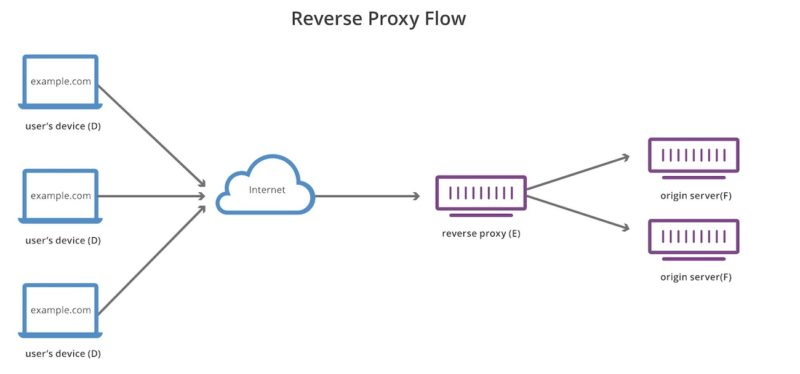
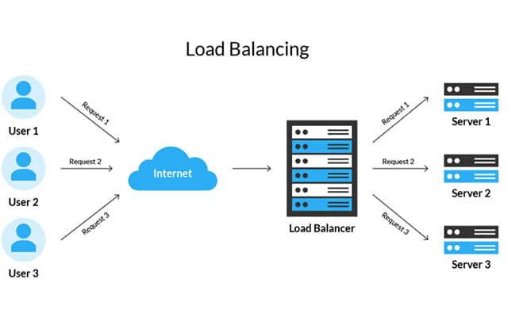

## Cover

<h3 align="center">
    <b>Praktikum Keamanan Jaringan</b> 
    Reverse Proxy and Load Balancing
</h3>
 

  

 

    Dosen Pembimbing: 
    Ferry Astika Saputra, S.T., M.Sc.

 

    Disusun Oleh: 
    Septiana Dyah Anissawati (3122640031)

 

    <b>
        KELAS D4 LJ IT B  
        JURUSAN D4 LJ TEKNIK INFORMATIKA B 
        DEPARTEMEN TEKNIK INFORMATIKA DAN KOMPUTER   
        POLITEKNIK ELEKTRONIKA NEGERI SURABAYA  
        2023
    </b>

 

## Laporan

## Reverse Proxy

Dalam komputasi, saat ketika mulai mengakses situs web, informasi dipertukarkan dari orang atau client ke server. Dalam hal ini, proses client mengirimkan permintaan ke server untuk mengakses situs web. Server kemudian mengirimkan respons ke client. Proses pertukaran data antara client dan server diharapkan dapat berjalan lancar tanpa menemui kendala teknis maupun non teknis, seperti loading website yang memakan waktu lama untuk melakukan penyerangan. Dengan bantuan proxy terbalik, pertukaran data antara client dan server berjalan lancar. Proxy terbalik berada di antara client dan server. Proxy terbalik juga dapat melindungi proses pertukaran data dari serangan DDoS. Biasanya, proxy terbalik diimplementasikan di server web.

Reverse proxy adalah jenis proxy yang bertanggung jawab untuk meneruskan permintaan client ke server. Reverse proxy biasanya diimplementasikan pada web server seperti Apache dan Nginx. Selain itu, reverse proxy yang dipinjam dari CloudFlare juga digunakan sebagai pengaman, sehingga pertukaran request dari client ke server atau sebaliknya aman. Selain itu reverse proxy juga dapat mengkompresi data. Big data dikompresi sehingga menjadi data yang lebih kecil. Dapat mempercepat pertukaran informasi. Reverse Proxy juga memiliki kemampuan untuk menyeimbangkan beban atau utilisasi server agar server tidak down.

Fungsi utama dari reverse proxy adalah menerima request dari client dan meneruskannya ke server atau sebaliknya. Cara kerja reverse proxy dapat dijelaskan menggunakan contoh berikut. Misalnya, Anda berperan sebagai pelanggan yang ingin mengakses sebuah website. Permintaan yang dibuat oleh client sebelum mereka tiba di server pertama kali diterima oleh proxy terbalik. Proxy terbalik kemudian meneruskan ke server dan menerima respons dari server, yang kemudian dikirimkan ke client. 

Contoh penggunaan dari reverse proxy adalah Nginx. Nginx dapat mengatur sebagai reverse proxy untuk melayani permintaan dari client dan meneruskannya ke server aplikasi yang berada dibelakangnya. Reverse proxy juga dapat menyembunyikan informasi penting seperti alamat IP server asli. Reverse proxy ini dapat menangani beberapa tugas lainnya seperti :

1. Menyembunyikan detail infrastruktur server di belakangnya. Klien hanya berinteraksi dengan reverse proxy tanpa mengetahui server aplikasi yang sebenarnya.
2. Menyediakan keamanan dengan melakukan validasi dan filtering permintaan sebelum meneruskannya ke server aplikasi.
3. Melakukan caching untuk mempercepat akses ke konten statis yang sering diminta.
4. Mengelola SSL/TLS untuk enkripsi data antara client dan server.

Selain itu reverse proxy digunakan untuk mengamankan server internal dari serangan langsung dari client serta memberikan berbagai manfaat tambahan seperti load balancing.

Load balancing merupakan proses mendistribusikan beban (load) permintaan dari client ke beberapa server aplikasi yang tersedia untuk meningkatkan kinerja, ketersediaan dan skalabilitas sistem. Tujuan utama dari load balancing adalah untuk memastikan bahwa setiap server aplikasi menerima jumlah permintaan yang seimbang, sehingga tidak ada server yang terlalu terbebani sementara yang lain tidak digunakan sepenuhnya. Beberapa teknik load balancing yang umum digunakan meliputi:

1. Round-robin: Permintaan secara bergantian diteruskan ke setiap server.
2. Least connections: Permintaan diteruskan ke server dengan koneksi paling sedikit.
3. Weighted: Server-server diberikan bobot berdasarkan kapasitas atau keandalannya.

Cara kerja load balancing adalah sebagai berikut:

1. Client mengirimkan permintaan (request) ke load balancer.
2. Load balancer menerima permintaan dan memutuskan ke server aplikasi mana permintaan tersebut akan diteruskan.
3. Load balancer menggunakan algoritma dan aturan tertentu untuk memilih server aplikasi yang akan menerima permintaan. Beberapa algoritma load balancing umum meliputi round-robin (mengirimkan permintaan secara bergantian ke setiap server), least connections (mengirimkan permintaan ke server dengan koneksi paling sedikit), dan weighted (memberikan bobot berdasarkan kapasitas server).
4. Load balancer meneruskan permintaan ke server aplikasi yang dipilih.
5. Server aplikasi memproses permintaan dan mengirimkan respons (response) kembali ke load balancer.
6. Load balancer meneruskan respons tersebut kepada client.

Contoh penerapan load balancing di Indonesia adalah dengan menggunakan solusi HAProxy atau menggunakan layanan cloud seperti Elastic Load Balancer (ELB) dari Amazon Web Services (AWS). Beberapa perusahaan di Indonesia mengadopsi solusi ini untuk mengatur lalu lintas permintaan dan memastikan ketersediaan dan kinerja aplikasi yang tinggi.

Dalam implementasi yang lebih kompleks, reverse proxy dan load balancing sering digunakan bersamaan. Reverse proxy digunakan sebagai titik masuk (entry point) untuk menerima permintaan dari client, sementara load balancer digunakan untuk mendistribusikan beban permintaan tersebut ke beberapa server aplikasi yang ada di belakangnya. Dengan kombinasi ini, kinerja sistem dapat ditingkatkan, skala aplikasi dapat diatur, dan ketersediaan dapat ditingkatkan melalui redundansi server.

