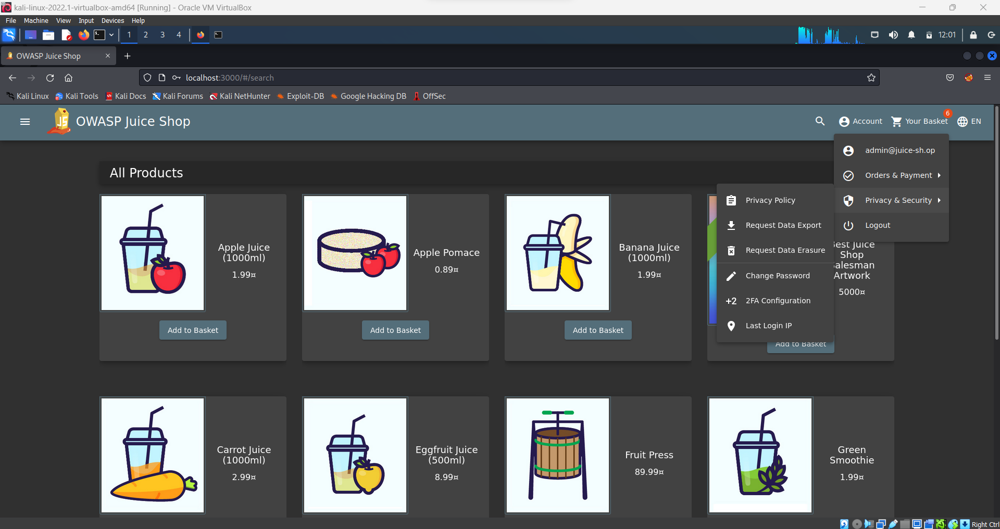
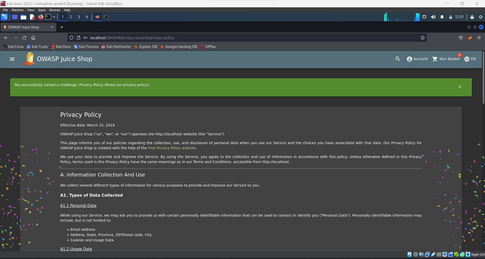
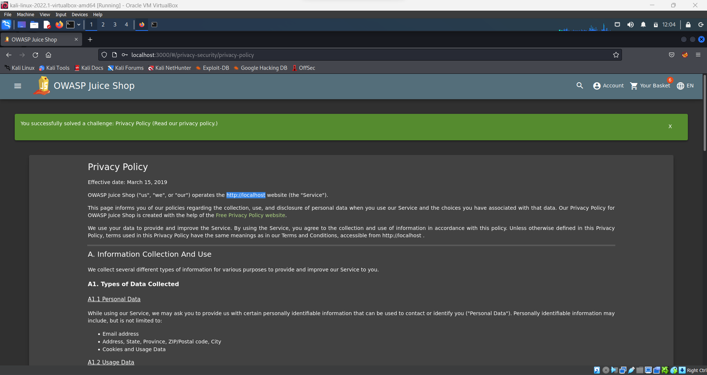
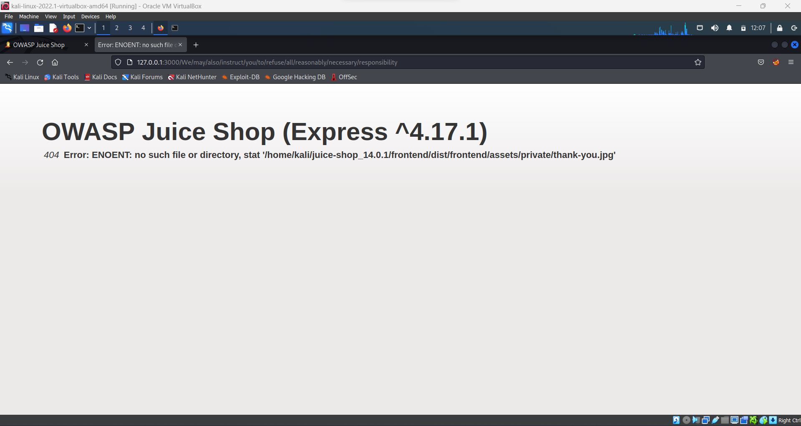
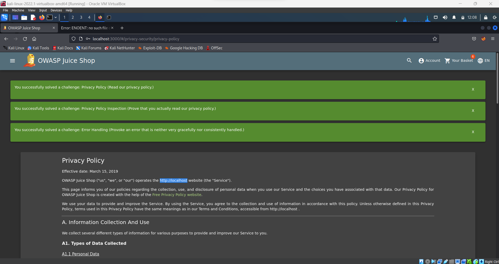

## Cover

<h3 align="center">
    <b>Praktikum Keamanan Jaringan</b> 
    Insecure Design
</h3>
 

  

 

    Dosen Pembimbing: 
    Ferry Astika Saputra, S.T., M.Sc.

 

    Disusun Oleh: 
    Septiana Dyah Anissawati (3122640031)

 

    <b>
        KELAS D4 LJ IT B  
        JURUSAN D4 LJ TEKNIK INFORMATIKA B 
        DEPARTEMEN TEKNIK INFORMATIKA DAN KOMPUTER   
        POLITEKNIK ELEKTRONIKA NEGERI SURABAYA  
        2023
    </b>

 

## Laporan

## INSECURE DESIGN

Insecure Design adalah kerentanan yang terjadi karena kesalahan dalam mendesain atau merancang sebuah program sebelum dilakukan pengkodean. Pengembang harus menerapkan beberapa prinsip seperti Secure By Design untuk meminimalisir dampak buruk pada aplikasi yang disebabkan oleh sistem itu sendiri. Banyak pengembang aplikasi tidak menerapkan prinsip-prinsip ini, sehingga mengakibatkan kerentanan pada aplikasi. Meskipun termasuk kategori yang luas, Insecure Design berbeda dengan Insecure Implementation karena penyebab dan cara perbaikannya berbeda. Insecure Implementation disebabkan oleh pengembang yang tidak mengimplementasikan design yang sudah dibuat dengan prinsip Secure By Design. Perbaikan pada Insecure Implementation lebih mudah daripada Insecure Design.

Berikut contoh penerapan Insecure Design pada aplikasi website OWASP Juice Shop:

## Privacy Policy Inspection

1. Masuk ke halaman Privacy Policy

    

    

2. Melakukan hover pada bagian alamat domain, kemudian muncul warna kuning

    

3. Ada kalimat lain yang muncul menjadi warna kuning

    a. http://127.0.0.1
    b. we may also
    c. instruct you
    d. to refuse all
    e. reasonably necessary
    f. responsibility

4. Menggabungkan menjadi endpoint url
http://127.0.0.1:3000/We/may/also/instruct/you/to/refuse/all/reasonably/necessary/responsibility

   

Terlihat bahwa informasi penting seperti framework beserta versi yang digunakan dan struktur direktori.

5. Hasil

    