## Cover

<h3 align="center">
    <b>Praktikum Keamanan Jaringan</b><br>
    Identification and Authentication Failures
</h3>
<br>
<p align="center">
  
</p>
<br>
<p align="center">
    Dosen Pembimbing:<br>
    Ferry Astika Saputra, S.T., M.Sc.
</p>
<br>
<p align="center">
    Disusun Oleh:<br>
    Septiana Dyah Anissawati (3122640031)
</p>
<br>
<p align="center">
    <b>
        KELAS D4 LJ IT B <br>
        JURUSAN D4 LJ TEKNIK INFORMATIKA B<br>
        DEPARTEMEN TEKNIK INFORMATIKA DAN KOMPUTER <br> 
        POLITEKNIK ELEKTRONIKA NEGERI SURABAYA <br>
        2023
    </b>
</p>
<br>

## Laporan

[VIDEO DEMO](https://drive.google.com/drive/folders/1Dp0PYbuwKfM34pbiMiGeTPeclaHBcVvL?usp=sharing)

## Identification and Authentication Failures

Identification and Authentication Failures diartikan sebagai kegagalan dalam mengidentifikasi dan memverifikasi seseorang atau sesuatu dengan benar. Misalnya hal yang terjadi dengan sistem komputer dan aplikasi. Saat akan mengakses suatu sistem atau aplikasi harus mengidentifikasi diri sendiri dan membuktikan bahwa kamu adalah pengguna yang sah. Hal ini bisa dilakukan dengan menggunakan username dan password, pin, aplikasi autentikator atau dengan menggunakan biometrik.

Apabila seseorang dapat mengakses sistem atau aplikasi tanpa harus memberikan informasi identifikasi yang benar itu sama haknya dengan kegagalan dalam identifikasi dan autentikasi. Contohnya, jika berhasil menebak kata sandi yang lemat atau menggunakan akun pengguna orang lain tanpa izin, itu adalah kegagalan dalam proses identifikasi dan autentikasi. 

## Reset Password OWASP Bjoern

Pada percobaan satu ini akan mereset password dari salah satu akun owasp Bjoern via Forgot Password dengan menjawab pertanyaan keamanan dari sistem.

1. Mencari akun dari username Bjoern pada review

    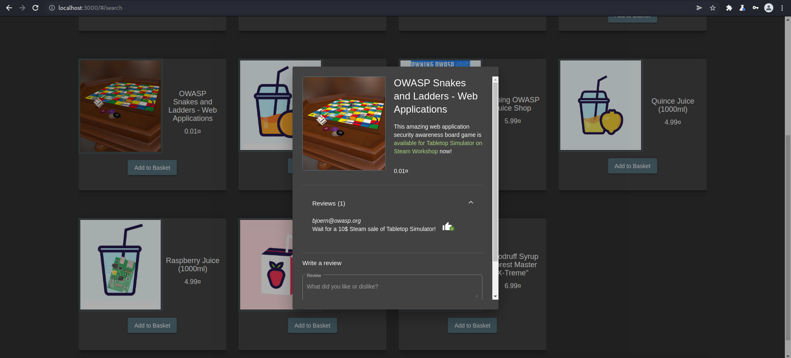

    Pada salah satu produk di juice shop terdapat satu review yang dilakukan oleh user Bjoern dimana disitu terlihat usernamenya adalah 'bjoern@owasp.org'.

2. Forgot your password ?

    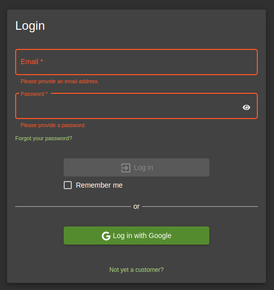

    Klik link Forgot your password? untuk menuju ke halaman dimana memperbaiki password yang lupa.

3. Mengisi inputan

    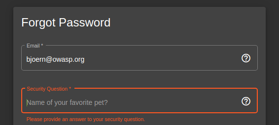

    Inputkan username/email yang telah ditemukan tadi yaitu 'bjoern@owasp.org' lalu isi security question dimana apa nama favorite hewan atau hewan yang disukai oleh Bjoern.

4. Mencari Hewan Favorit di Internet

    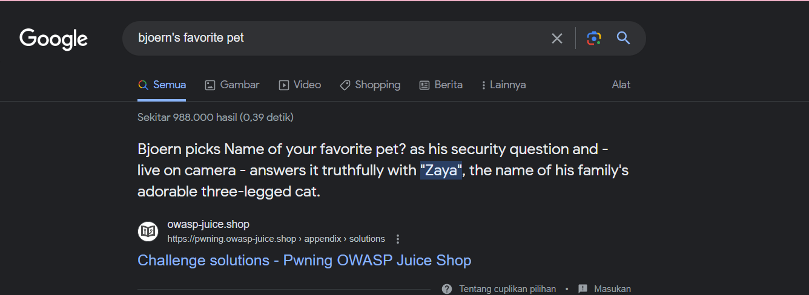

    Dan didapatkan diinternet bahwa hewan yang disukai Bjoern adalah "Zaya".

5. Inputkan password

    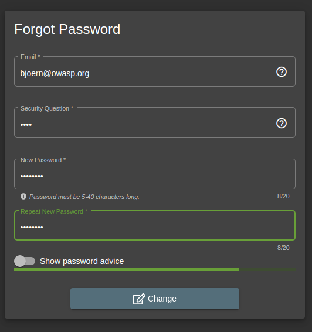

    Setelah menginputkan security question, saya mengisi password baru yang berisi : Admin123. Lalu klik change maka akan mendapatkan alert seperti ini :

    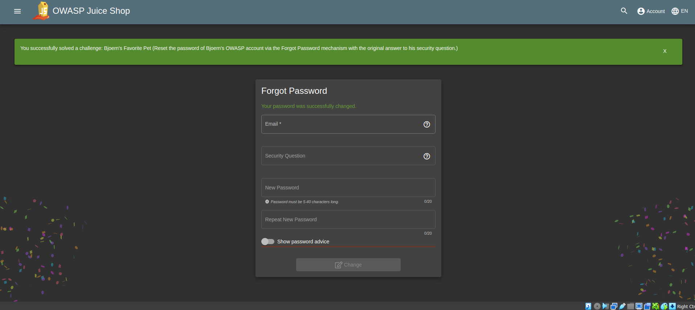

6. Login

    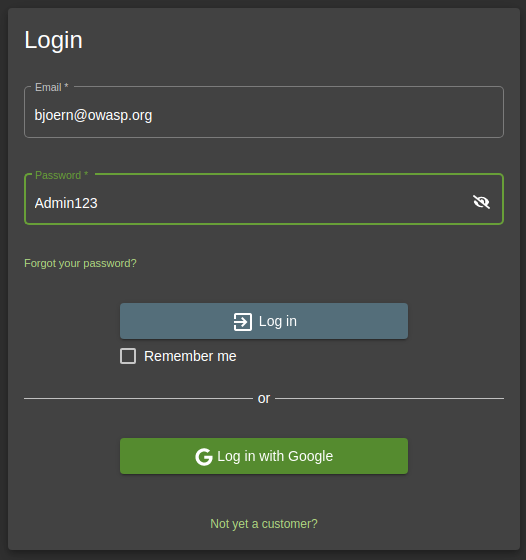

    Untuk membuktikan apakah berhasil atau tidak saya melakukan login sebagai Bjoern dengan password yang sudah saya ganti tersebut.

    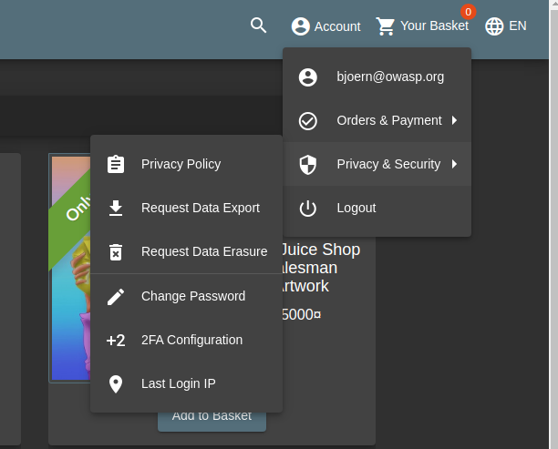

    Dan saya berhasil login sebagai Bjoern.

## Kredensial User Administrator

Percobaan ini yaitu tentang kredensial user administrator tanpa mengubah password saat ini atau menerapkan SQL Injection.

1. SQLmap

   ```sqlmap -u “http://localhost:3000/rest/user/login” --data=“email=test@test.com&password=test” --level=5 --risk=3 --banner --ignore-code=401 --dbms='sqlite' --technique=B```

    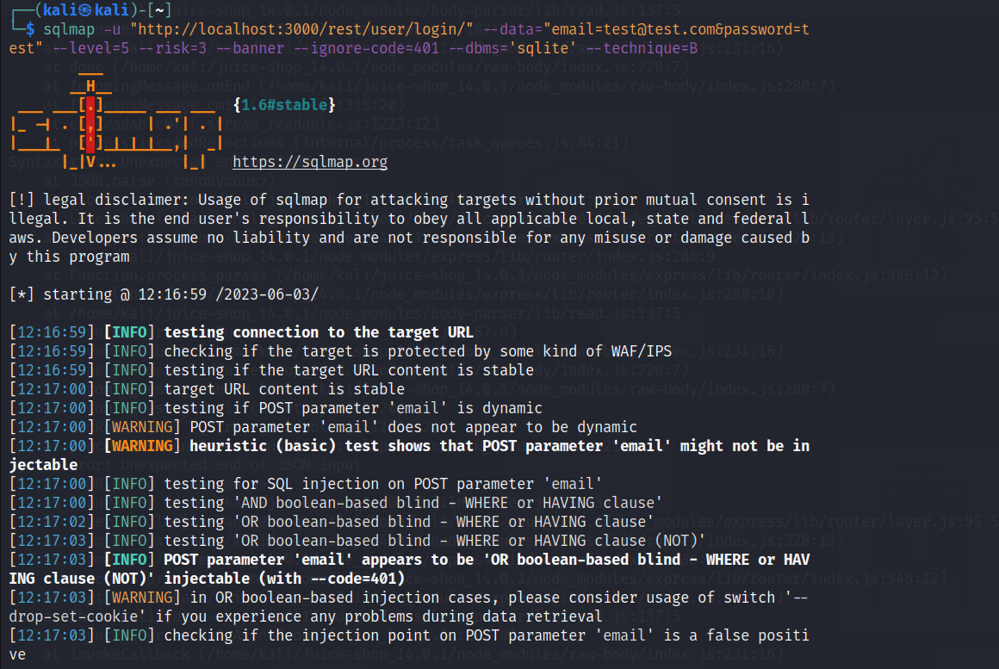

    -u "http://localhost:3000/rest/user/login": Menentukan URL target yang akan diuji menggunakan SQLMap. Dalam kasus ini, URL target adalah "http://localhost:3000/rest/user/login".

    --data="email=test@test.com&password=test": Menentukan data yang dikirim sebagai payload dalam bentuk parameter POST untuk melakukan serangan SQL Injection.

    --level=5: Mengatur tingkat kecerobohan SQLMap, di mana level 5 adalah tingkat tertinggi. Ini mempengaruhi seberapa dalam SQLMap akan mencoba mengeksploitasi kerentanan SQL Injection.

    --risk=3: Mengatur tingkat risiko SQLMap, di mana risiko 3 adalah risiko tertinggi. Ini mempengaruhi seberapa agresif SQLMap akan menguji kerentanan SQL Injection.

    --banner: Menampilkan banner SQLMap saat dimulai.

    --ignore-code=401: Mengabaikan kode respons HTTP 401 (Unauthorized) dan melanjutkan dengan serangan.

    --dbms='sqlite': Menentukan jenis sistem manajemen basis data yang digunakan dalam aplikasi target. Dalam kasus ini, jenis DBMS yang digunakan adalah SQLite.

    --technique=B: Menggunakan teknik serangan Blind SQL Injection.

    Perintah ini secara efektif menjalankan SQLMap dengan konfigurasi dan opsi yang ditentukan untuk menguji kerentanan SQL Injection pada URL target yang diberikan, dengan menggunakan data yang disertakan sebagai payload dalam parameter POST. SQLMap akan mencoba secara otomatis mengeksploitasi kerentanan SQL Injection yang mungkin ada dalam aplikasi target dan memberikan laporan tentang hasilnya. Dan hasilnya adalah error 401 dimana request yang dikirim ke website tidak dapat diautentikasi.

2. Jalankan perintah yang sama namun mengganti email

   ```sqlmap -u “http://localhost:3000/rest/user/login” --data=“email=admin@juice-sh.op&password=test” --level=5 --risk=3 --banner --ignore-code=401 --dbms='sqlite' --technique=B```

   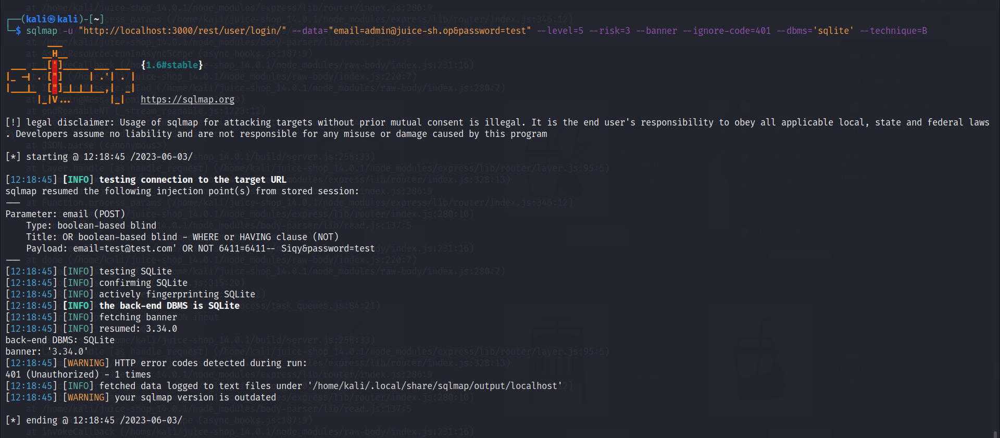

   Hasilnya tetap 401 maka email dan password masih belum benar.

3. Jalankan perintah yang sama namun mengganti password

   ```sqlmap -u “http://localhost:3000/rest/user/login” --data=“email=admin@juice-sh.op&password=admin123” --level=5 --risk=3 --banner --ignore-code=401 --dbms='sqlite' --technique=B```

   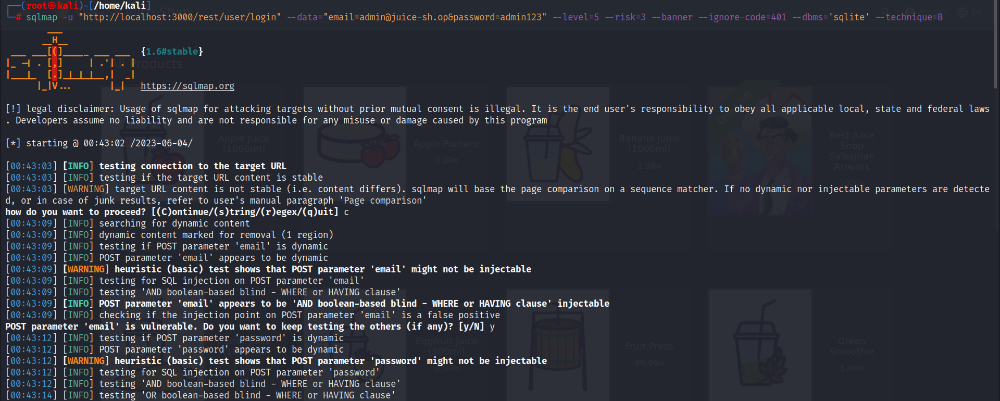

   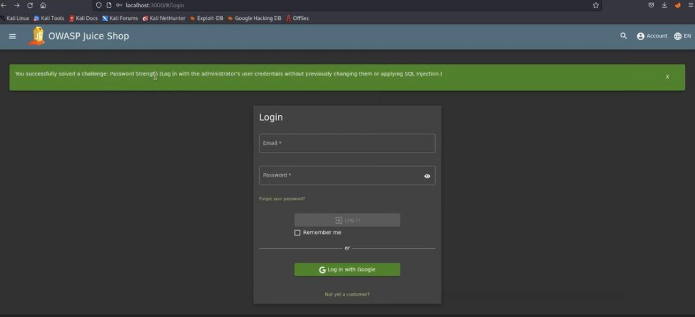

   Hasilnya akan tampil alert challenge password strength berhasil dilakukan.