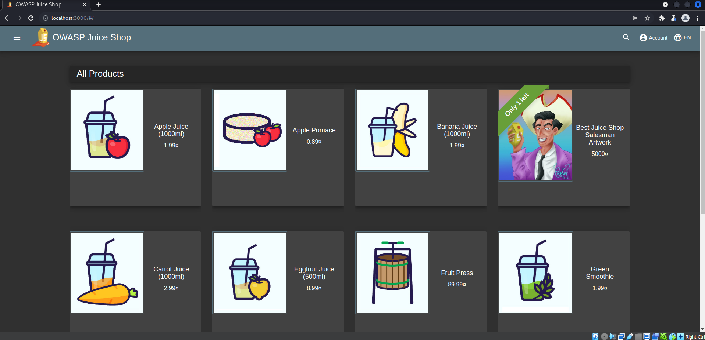
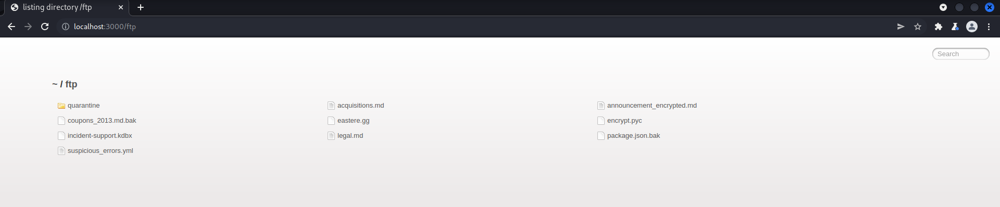
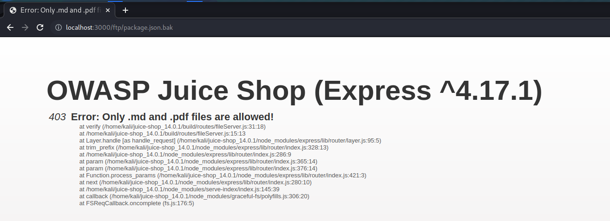
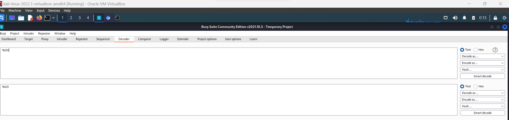
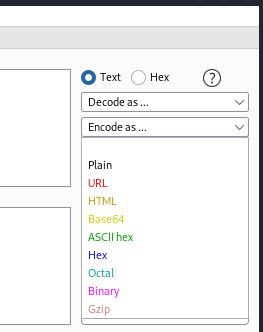
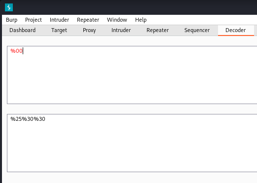
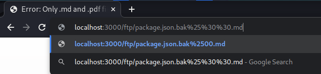
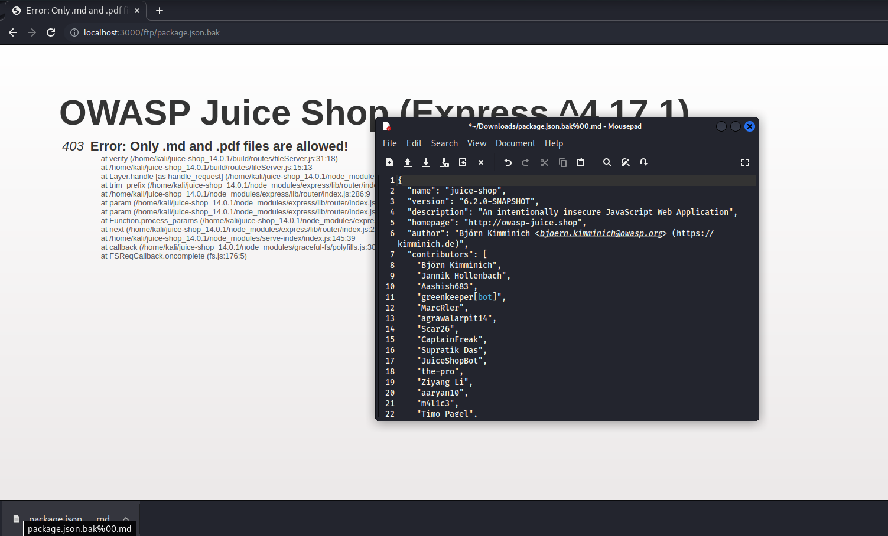

## Cover

<h3 align="center">
    <b>Praktikum Keamanan Jaringan</b> 
    Software and Data Integrity Failures
</h3>
 

  

 

    Dosen Pembimbing: 
    Ferry Astika Saputra, S.T., M.Sc.

 

    Disusun Oleh: 
    Septiana Dyah Anissawati (3122640031)

 

    <b>
        KELAS D4 LJ IT B  
        JURUSAN D4 LJ TEKNIK INFORMATIKA B 
        DEPARTEMEN TEKNIK INFORMATIKA DAN KOMPUTER   
        POLITEKNIK ELEKTRONIKA NEGERI SURABAYA  
        2023
    </b>

 

## Laporan

## Software and Data Integrity Failures

Software and Data Integrity Failures dapat diartikan dengan kegagalan dalam menjaga keutuhan perangkat lunak dan data. Dalam sebuah komputer dan teknologi informasi hal yang terjadi dengan perangkat lunak dan data. Perangkat lunak adalah program-program yang berjalan di komputer dan memungkinkan kita untuk melakukan berbagai tugas. Data adalah informasi yang disimpan dalam komputer, seperti dokumen, foto, atau video. Namun jika dimodifikasi atau mengubah perangkat lunak atau data tanpa izin, itu merupakan kegagalan dalam menjaga keutuhan perangkat lunak dan data.

Aplikasi saat ini banyak memiliki fitur pembaharuan otomatis yang mana dapat diunduh tanpa adanya verifikasi integritas dan diterapkan/digunakan pada aplikasi yang sebelumnya terpercaya. Penyerang memiliki kemungkinan besar untuk menggunggah pembaharuan milik mereka sendiri untuk didistribusikan dan dijalankan pada semua instalasi.

Jadi Software and Data Integrity Failures yaitu tentang pentingnya menjaga keutuhan perangkat lunak dan data. Melibatkan langkah-langkah untuk mencegah perubahan yang tidak sah atau merusak pada perangkat lunak dan data, sehingga dapat dipercayai bahwa pembaharuan tetap aman dan tidak berubah secara tidak sah.

## Percobaan

Pada percobaan kali ini akan menunjukkan kode tanpa pemeriksaan integritas.

1. Buka Aplikasi Juice Shop

    

    Pertama-tama siapkan burpsuite dan jalankan aplikasi juice shop

2. Menambahkan /ftp setelah link Juice Shop

    

    Ketika menambahkan /ftp pada URL Juice Shop hal itu akan mengidentifikasi bahwa ingin mengakses ke direktori FTP yang mana terdapat file-file yang dapat diakses atau dianalisis dari segi keamanan.

3. Klik package.json.bak

    

    File "package.json.bak" yang ada dalam direktori FTP mengindikasikan adanya salinan cadangan (backup) dari file "package.json" dalam aplikasi Juice Shop. File "package.json" adalah file konfigurasi yang biasanya digunakan dalam proyek aplikasi web berbasis Node.js. File ini berisi daftar dependensi atau modul yang digunakan oleh aplikasi, versi-versi modul tersebut, dan konfigurasi lainnya.

4. Membuka BurpSuite lalu menuju ke menu Decoder, masukkan %00

    

    Apabila "%00" dimasukkan ke dalam decoder, maka akan diubah menjadi karakter null (\0) dalam format ASCII. Karakter null adalah karakter khusus yang memiliki nilai nol (0) dan biasanya digunakan untuk menandai akhir dari sebuah string atau data dalam beberapa konteks pemrograman. Pada beberapa kasus, penggunaan "%00" atau karakter null dapat digunakan dalam serangan yang disebut "Null Byte Injection". Serangan ini melibatkan manipulasi string atau data dengan menyisipkan karakter null (%00) untuk memanipulasi atau mengakali sistem yang memproses string tersebut. Dalam konteks URL atau pengiriman data melalui HTTP, penggunaan "%00" dapat mempengaruhi parsing atau pemrosesan data oleh aplikasi atau server yang menerima input tersebut. Beberapa aplikasi atau server mungkin tidak mengantisipasi karakter null (%00) dalam input yang mereka terima, sehingga dapat memungkinkan serangan atau eksploitasi tertentu.

5. Melakukan Encode as URL

    

    

6. Copy hasil encode pada URL package.json.bak

    

    Setelah itu kode akan langsung terunduh.

7. Hasil

    

    Berikut hasilnya.
