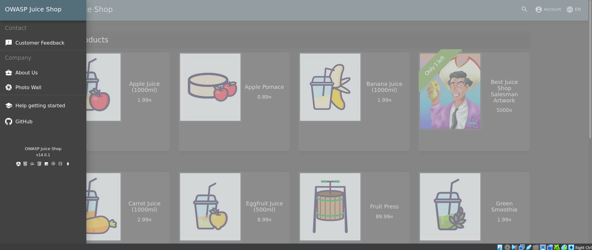
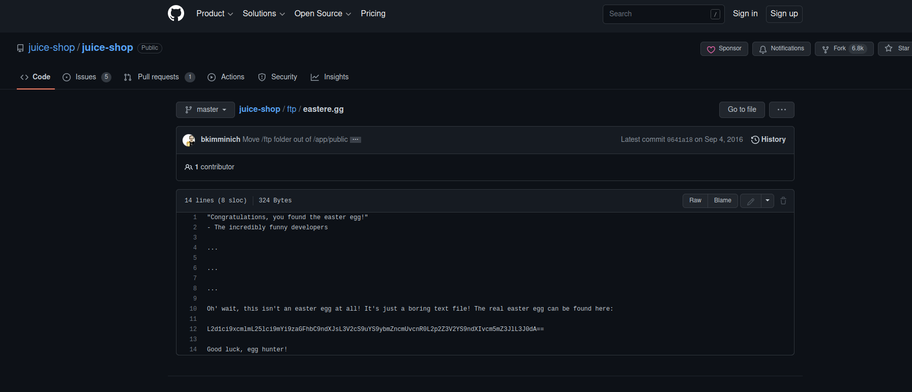
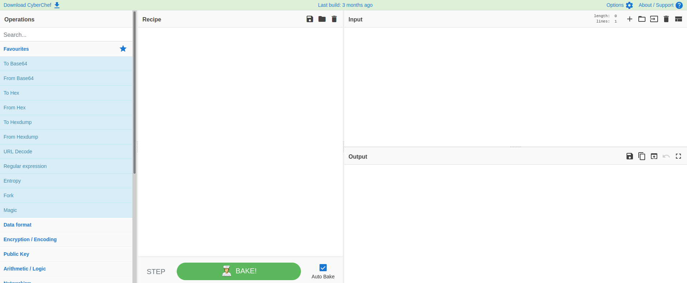
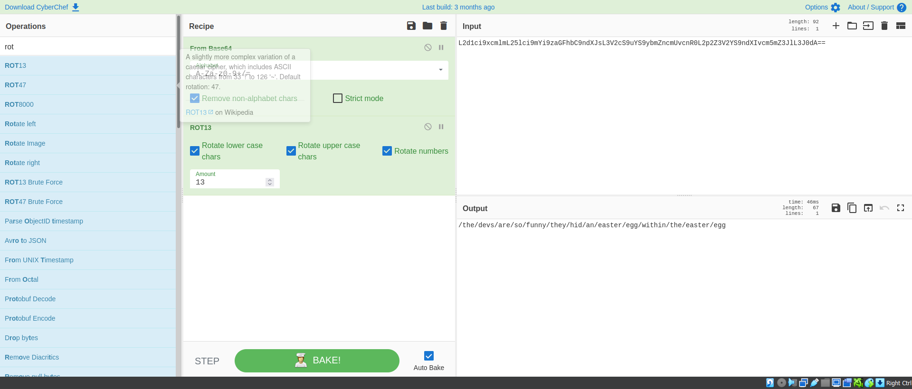
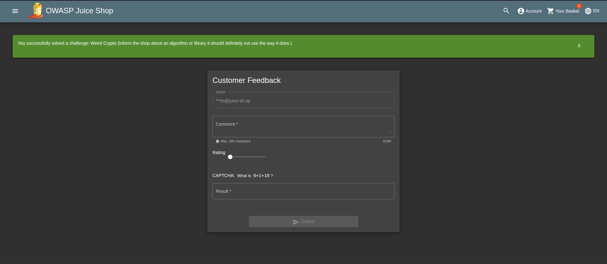
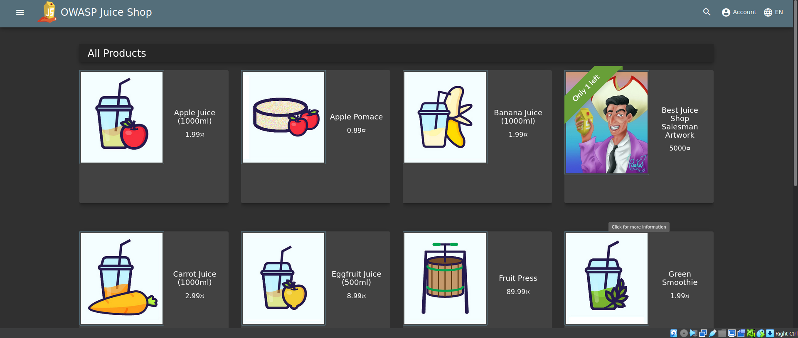
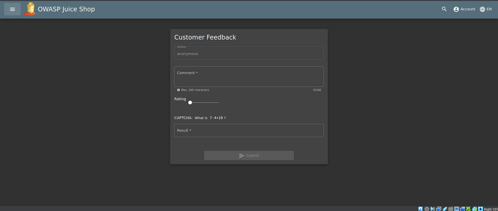
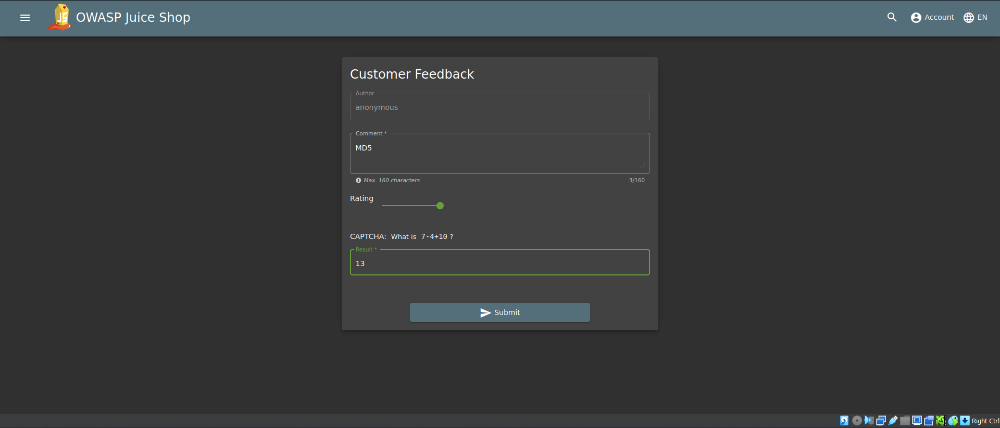
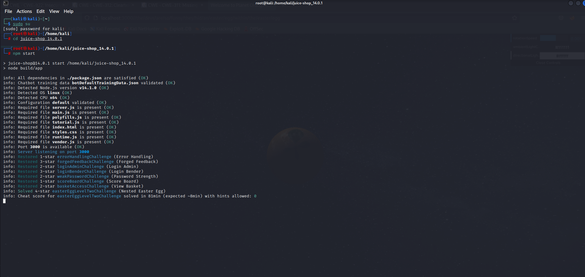

## Cover

<h3 align="center">
    <b>Praktikum Keamanan Jaringan</b> 
    Cryptographic Failures (OWASP 10 Juice Shop)
</h3>
 

  

 

    Dosen Pembimbing: 
    Ferry Astika Saputra, S.T., M.Sc.

 

    Disusun Oleh: 
    Septiana Dyah Anissawati (3122640031)

 

    <b>
        KELAS D4 LJ IT B  
        JURUSAN D4 LJ TEKNIK INFORMATIKA B 
        DEPARTEMEN TEKNIK INFORMATIKA DAN KOMPUTER   
        POLITEKNIK ELEKTRONIKA NEGERI SURABAYA  
        2023
    </b>

 

## Laporan

[VIDEO DEMO](https://drive.google.com/file/d/1-DEno8DiTKt04n9y7VzCVgy96aFF-DMD/view?usp=sharing)

## Cryptographic Failures
Cryptographic failures adalah kegagalan atau kerentanan dalam penggunaan teknik kriptografi untuk melindungi informasi atau data sensitif. Kegagalan ini bisa terjadi karena penggunaan algoritma yang lemah, pengaturan konfigurasi yang tidak tepat, atau kesalahan dalam implementasi.

Kegagalan kriptografi dapat mengakibatkan kerugian yang signifikan, seperti pencurian identitas, pencurian data, dan pelanggaran privasi. Untuk menghindari kegagalan ini, sangat penting untuk memastikan bahwa sistem kriptografi diimplementasikan dengan benar dan selalu diperbarui untuk mengikuti standar keamanan terbaru.

Berikut adalah beberapa contoh dari cryptographic failures:

1. Key Management Failures: Kegagalan dalam manajemen kunci dapat membuat kunci enkripsi menjadi lemah atau mudah ditebak. Hal ini dapat memungkinkan pengguna yang tidak sah untuk membaca atau mengubah data yang dienkripsi.

2. Weak Encryption Algorithms: Penggunaan algoritma enkripsi yang lemah atau usang dapat memungkinkan penyerang untuk menguraikan data yang dienkripsi dengan mudah.

3. Implementation Errors: Kesalahan dalam implementasi kriptografi dapat menyebabkan kerentanan, seperti backdoor atau bug yang dapat dimanfaatkan oleh penyerang.

4. Random Number Generation: Kegagalan dalam penghasilan angka acak atau random number generation dapat membuat kunci enkripsi menjadi lemah dan mudah ditebak.

## Nested Easter Egg

1. Easter egg merupakan pesan tersembunyi yang telah disisipkan kedalam website. Pertama pilih Github untuk masuk ke direktori ftp.

    

2. Setelah masuk ke github lalu menuju ke folder ftp dan pilih file eastere.egg

    

    Copy file enskripsi dibawah

3. Buka Cyber Chef

    

4. Tambah base64 dan encryption ROT 13

    

    Base64 dan ROT13 adalah dua jenis encoding atau teknik enkripsi sederhana yang digunakan untuk mengubah teks atau data menjadi bentuk yang sulit dibaca oleh manusia, namun masih dapat dibaca oleh mesin.

    Base64 adalah metode encoding yang mengubah data menjadi bentuk 64 karakter ASCII yang berbeda. Proses encoding base64 mengambil data biner dan membaginya menjadi blok-blok 6 bit, lalu setiap blok diubah menjadi karakter ASCII yang sesuai. Keuntungan dari Base64 adalah bahwa dapat digunakan untuk mengirim data melalui jaringan yang tidak dapat mengirim karakter non-ASCII seperti gambar, file audio atau video.

    ROT13 adalah jenis encoding sederhana yang mengubah setiap huruf dalam teks dengan huruf yang berada 13 posisi di belakangnya dalam abjad. Jika setelah 13 posisi huruf tidak cukup, maka pencarian akan dimulai kembali dari huruf awal. ROT13 biasanya digunakan untuk mengenkripsi pesan atau teks yang tidak sensitif secara rahasia.

5. Masukkan output enkripsi dan tambahkan pada link localhost/3000

    

6. Hasil

    

### Kesimpulan

Easter egg sendiri merujuk pada fitur yang tersembunyi dalam perangkat lunak atau aplikasi, yang tidak diumumkan atau didokumentasikan. Nested Easter Egg mengacu pada Easter Egg yang ditemukan di dalam Easter Egg yang lain. Dalam hal keamanan, jika nested Easter Egg tidak diidentifikasi dan diuji dengan baik, mereka dapat mengakibatkan risiko keamanan seperti kerentanan atau celah yang tidak diketahui dalam aplikasi atau sistem. Oleh karena itu, penting untuk memeriksa dan menguji semua fitur dalam perangkat lunak atau aplikasi untuk menemukan Easter Egg yang mungkin tersembunyi, termasuk yang bersifat nested.

## Weird Crypto (Cryptographic Issues)

1. Membuka halaman juice-shop

    

2. Klik sidebar -> Customer Feedback

    

3. Pada menu Customer Feedback masukkan kata MD5 pada comment, masukkan rating lalu chaptcha.

    

4. Hasil

    

### Kesimpulan

Weird Crypto tidak termasuk dalam daftar OWASP Top 10, karena bukan merupakan salah satu kategori dari 10 risiko keamanan aplikasi web yang paling umum terjadi. Namun, penggunaan algoritma kriptografi yang tidak standar atau tidak teruji dengan baik dapat menyebabkan kerentanan keamanan dalam aplikasi web dan dapat menyebabkan risiko keamanan yang serius. Oleh karena itu, masalah keamanan yang terkait dengan penggunaan weird crypto dapat termasuk dalam kategori A5 (Security Misconfiguration) dan A6 (Security-Related Code Quality Issues) dalam daftar OWASP Top 10. Dalam kategori ini, masalah keamanan yang terkait dengan konfigurasi dan kode berkualitas buruk dalam aplikasi web dapat menyebabkan kerentanan keamanan dan membuka pintu bagi serangan seperti serangan injeksi, penyusupan, dan peretasan.

Masalah keamanan yang terkait dengan penggunaan weird crypto dapat termasuk dalam kategori A5 (Security Misconfiguration) dan A6 (Security-Related Code Quality Issues) dalam daftar OWASP Top 10 karena penggunaan algoritma kriptografi yang tidak standar atau tidak teruji dengan baik dapat menjadi bagian dari masalah konfigurasi atau kode yang berkualitas buruk dalam aplikasi web.

Dalam kategori A5 (Security Misconfiguration), masalah keamanan terkait dengan konfigurasi aplikasi web yang tidak memadai atau tidak aman dapat menciptakan celah keamanan yang dapat dimanfaatkan oleh penyerang. Jika penggunaan weird crypto dilakukan dengan konfigurasi yang buruk atau tidak tepat, hal ini dapat menyebabkan celah keamanan dalam aplikasi web dan menyebabkan risiko keamanan yang serius.

Sementara dalam kategori A6 (Security-Related Code Quality Issues), masalah keamanan terkait dengan kualitas kode yang buruk dalam aplikasi web dapat menyebabkan kerentanan keamanan dan membuka pintu bagi serangan seperti serangan injeksi, penyusupan, dan peretasan. Jika penggunaan weird crypto dilakukan dengan kode yang berkualitas buruk atau tidak tepat, hal ini dapat menyebabkan kerentanan keamanan dalam aplikasi web dan menyebabkan risiko keamanan yang serius.

Dalam kedua kasus ini, masalah keamanan yang terkait dengan penggunaan weird crypto dapat membuka celah keamanan dalam aplikasi web dan dapat menyebabkan risiko keamanan yang serius, sehingga masalah ini harus diperhatikan dan diatasi dengan baik.

