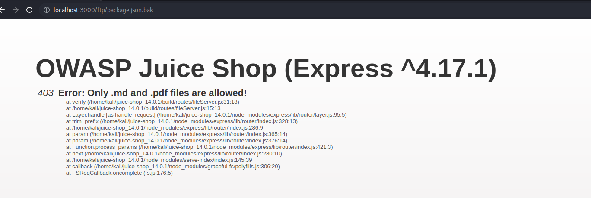

## Cover

<h3 align="center">
    <b>Praktikum Keamanan Jaringan</b> 
    Vulnerability and Outdated Components
</h3>
 

  

 

    Dosen Pembimbing: 
    Ferry Astika Saputra, S.T., M.Sc.

 

    Disusun Oleh: 
    Septiana Dyah Anissawati (3122640031)

 

    <b>
        KELAS D4 LJ IT B  
        JURUSAN D4 LJ TEKNIK INFORMATIKA B 
        DEPARTEMEN TEKNIK INFORMATIKA DAN KOMPUTER   
        POLITEKNIK ELEKTRONIKA NEGERI SURABAYA  
        2023
    </b>

 

## Laporan

[VIDEO DEMO](https://drive.google.com/drive/folders/1Dp0PYbuwKfM34pbiMiGeTPeclaHBcVvL?usp=sharing)

## Vulnerability and Outdated Components

Vulnerability diartikan sebagai keamanan siber atau celah keamanan. Outdated component merupakan komponen atau bagian-bagian yang tidak diperbarui atau sudah usang. Komponen yang rentan dan kadaluwarsa mengacu pada saat kode sumber terbuka atau berpemilik berisi kerentanan perangkat lunak atau tidak lagi dipertahankan. Kodei ini bisa berupa Laravel (PHP), Angular (JavaScript), Django (Python), dll. Kode tersebut sering diimplementasikan dengan sedikit atau tanpa pertimbangan keamanan, sehingga mengarah pada konsekuensi yang berpotensi menyedihkan bagi pengguna aplikasi dan membahayakan reputasi perusahaan.

Namun seiringnya berjalan waktu, pengembang sebuah aplikasi harus terus memperbaiki dan memperbaharui komponen-komponen untuk meningkatkan keamanan dan memperbaiki masalah yang ada. Jika kita tidak memperbaharui secara teratur maka komponen tersebut akan usang atau outdated. Hal itu juga menyebabkan sebuah aplikasi memiliki celah keamanan yang diketahui oleh penyerang dan penyerang dapat memanfaatkan untuk melakukan serangan.

Jadi Vulnerability and Outdated Components dalam OWASP Top 10 adalah tentang pentingnya mengidentifikasi dan memperbaiki kerentanan atau celah keamanan dalam sistem kita, serta memperbarui komponen-komponen yang digunakan agar tetap aman dari serangan oleh orang jahat.

## Percobaan

Pada percobaan serangan vulnerable component dapat dilakukan Legacy Typosquatting. Jadi Legacy Typosquatting lebih diartikan dengan kesalahan pengetikan (typos) dalam nama domain yang sudah tidak aktif atau sudah tidak digunakan lagi (legacy). Praktik ini dengaja mendaftarkan atau membeli nama domain yang mirip secara ejaan dengan nama domain yang populer tetapi dengan kesalahan penegtikan yang umum.

1. Menambahkan /ft pada link Juice Shop

    

    Terdapat folder package.json.bak klik folder tersebut.

2. Membuka file package.json.bak

    

    File "package.json.bak" yang ada dalam direktori FTP mengindikasikan adanya salinan cadangan (backup) dari file "package.json" dalam aplikasi Juice Shop. File "package.json" adalah file konfigurasi yang biasanya digunakan dalam proyek aplikasi web berbasis Node.js. File ini berisi daftar dependensi atau modul yang digunakan oleh aplikasi, versi-versi modul tersebut, dan konfigurasi lainnya.

3. Menambahkan %2500.md pada path URL

    

    Ketika %2500.md ditambahkan pada path URL itu berarti bahwa kita sedang mencoba mengakses file dengan nama "package.json.bak" didalam direktori yang memiliki ekstensi atau sub-direktori bernama %00.md. Secara umum, karakter "%" digunakan dalam URL sebagai bagian dari proses encoding atau pengodean karakter khusus. Di sini, "%25" adalah representasi heksadesimal dari karakter "%", yang berarti kita mencoba menyertakan karakter "%" itu sendiri dalam path URL. Kemudian, ".d" adalah ekstensi yang ditambahkan ke path tersebut.

4. Membuka hasil file yang telah didownload

    

5. Mencari bagian dependencies

    

    Didalam file tersebut pada bagian dependencies ada body-parser. "body-parser" adalah sebuah library atau modul yang digunakan untuk mengurai (parse) data yang dikirim melalui permintaan HTTP, terutama data dalam bentuk body request.

6. Membuka npmjs untuk melakukan pengecekan pada tiap dependencies yang mencurigakan

    

7. Lalu saya menemukan dependencies bernama epilogue-js

    

    epilogue-js merupakan library atau modul JavaScript yang digunakan dalam pengembanga aplikasi web untuk menyederhanakan dan mempercepat proses pembuatan APIRESTful. Dan ketika di lihat pada npmjs terdapat kalimat "This repository exists only for security awareness and training purpose to demonstrate the issue of typosquatting".

8. Pergi ke halaman Customer Feedback pada Juice Shop

    

    Inputkan ke dalam inputan pada form Customer Feedback, dan hasilnya percobaan telah selesai. Dalam konteks Juice Shop, jika pengguna menginputkan kata "epilogue-js" sebagai bagian dari feedback pada halaman customer feedback, ini tidak secara langsung terkait dengan legacy typosquatting. Namun, hal tersebut bisa menjadi contoh dari penggunaan istilah atau nama yang mirip dengan nama komponen atau library yang dikenal seperti "epilogue-js".