## Cover

<h3 align="center">
    <b>Praktikum Keamanan Jaringan</b><br>
    Security Logging and Monitoring Failures
</h3>
<br>
<p align="center">
  
</p>
<br>
<p align="center">
    Dosen Pembimbing:<br>
    Ferry Astika Saputra, S.T., M.Sc.
</p>
<br>
<p align="center">
    Disusun Oleh:<br>
    Septiana Dyah Anissawati (3122640031)
</p>
<br>
<p align="center">
    <b>
        KELAS D4 LJ IT B <br>
        JURUSAN D4 LJ TEKNIK INFORMATIKA B<br>
        DEPARTEMEN TEKNIK INFORMATIKA DAN KOMPUTER <br> 
        POLITEKNIK ELEKTRONIKA NEGERI SURABAYA <br>
        2023
    </b>
</p>
<br>

## Laporan

[VIDEO DEMO](https://drive.google.com/drive/folders/1Dp0PYbuwKfM34pbiMiGeTPeclaHBcVvL?usp=sharing)

## Security Logging and Monitoring Failures

Security Logging and Monitoring Failures merupakan salah satu kerentanan keamanan pada aplikasi web yang terjadi ketika sistem atau aplikasi web tidak memiliki mekaniesme pengawasan dan pencatatan yang memadai untuk aktivitas pengguna dan akses sistem. Hal tersebut menyebabkan para penyerang dapat melakukan serangan yang tidak terdeteksi atau menghindari pengawasan oleh security profesional.

Pada dasarnya, tidak adanya mekanisme yang efektif untuk melacak, memantau dan mencatat aktivitas yang mencurigakan atau aneh yang terjadi didalam sistem. Tanpa pemantauan dan pencatatan keamanan, sebuah organisasi tidak dapat dengan cepat mendetekso atau merespons serangan aktivitas berbahaya yang terjadi di jaringan atau aplikasi mereka.

Dalam Security Logging and Monitoring Failures mengacu pada perluasan CWE-778, yang merupakan Kekurangan Pencatatan yang Tidak Memadai, dengan memasukkan tiga kelemahan lainnya yang terkait: CWE-117, CWE-223, dan CWE-532.

1. CWE-117 Improrer Output Netralization for Logs
   CWE-117 merujuk pada kegagalan dalam melakukan netralisasi atau perlakuan khusus terhadap input yang tidak dipercaya sebelum memasukkannya ke dalam log sistem. Ini berarti bahwa data yang berpotensi berbahaya atau berbahaya dapat disisipkan dalam log sistem tanpa diolah atau diolah dengan cara yang tidak memadai. Akibatnya, log tersebut dapat menjadi sumber informasi yang buruk atau tidak dapat diandalkan, karena data yang masuk tidak dibersihkan dengan benar atau dinetralisasi.
2. CWE-223 Omission of Security-relevant Information
   CWE-223 mengacu pada kegagalan dalam memasukkan informasi yang relevan untuk keamanan ke dalam log sistem. Hal ini terjadi ketika sistem tidak mencatat atau mengabaikan informasi yang penting untuk mengidentifikasi atau menganalisis aktivitas yang berpotensi berbahaya atau serangan. Dengan tidak mencatat informasi yang relevan secara memadai, organisasi kehilangan wawasan penting yang dapat membantu dalam mendeteksi dan menanggapi ancaman keamanan.
3. CWE-532 Insertion of Sensitive Information into Log File
   CWE-532 melibatkan penyisipan informasi sensitif atau rahasia ke dalam file log sistem. Hal ini terjadi ketika data yang seharusnya tidak ditampilkan atau direkam secara terbuka dalam log, seperti kata sandi, kunci enkripsi, atau data pribadi yang sensitif, disimpan di log sistem. Praktik ini dapat mengakibatkan akses tidak sah ke informasi sensitif oleh pihak yang tidak berwenang dan meningkatkan risiko kebocoran data atau pelanggaran privasi.

## Percobaan Mendownload File Access Log

File access log merupakan pencatatan aktivitas akses file yang dilakukan oleh pengguna atau sistem dalam aplikasi yang rentan terhadap serangan. Tujuan file tersebut adalah untuk mencatat dan memantau setiap kali sebuah file diakses.

1. Persiapkan juice shop

    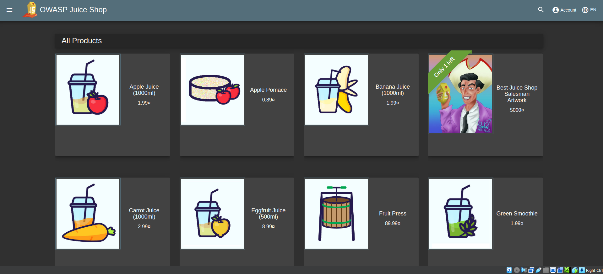

    Pertama-tama siapkan juice shop wensite dan buka pada halaman utama.

2. FFUF

    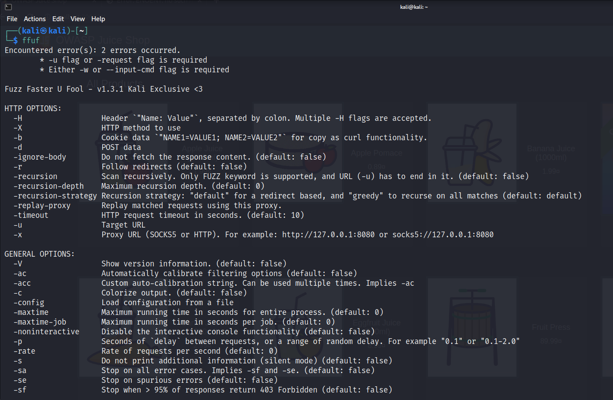

    FFUF adalah alat/tool yang digunakan untuk melakukan fuzzing terhadap URL atau endpoint pada suatu aplikasi web. Fuzzing sendiri merupakan teknik pengujian keamanan yang digunakan untuk mencari kerentanan dalam aplikasi dengan memberikan input yang tidak valid atau tidak terduga. Dalam konteks FFUF, kita memberikan input berupa URL atau endpoint pada aplikasi web yang ingin kita uji keamanannya. FFUF akan secara otomatis mengirimkan permintaan HTTP dengan variasi parameter dan nilai yang berbeda-beda untuk mencoba menemukan kerentanan dalam aplikasi tersebut. Berikut contoh perintah FFUF :

    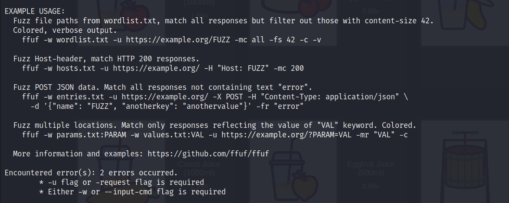

3. Menjalankan FFUF untuk fuzzing URL

   ```$ ffuf -w /usr/share/wordlists/dirb/common.txt -u http://localhost:3000/FUZZ```

    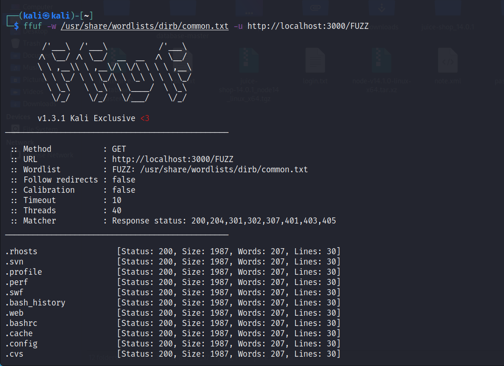

    -u /usr/share/wordlists/dirb/common.txt menunjukkan bahwa daftar kata-kata yang terdapat dalam file /usr/share/wordlists/dirb/common.txt akan digunakan sebagai payload untuk fuzzing. File ini berisi daftar umum dari direktori atau path yang sering digunakan dalam aplikasi web.

    -u http://localhost:3000/FUZZ menunjukkan URL target yang akan di-fuzz. Di sini, http://localhost:3000 adalah URL dari aplikasi web juice shop yang akan diuji, dan FUZZ adalah placeholder yang akan digantikan dengan kata-kata dari file wordlist.

    FFUF megirimkan permintaan HTTP ke URL target dengan kata-kata dari file wordlist sebagai parameter yang divariasikan. Hal ini membantu dalam mencari direktori atau endpoint yang mungkin tidak terlihat atau diakses secara langsung melalui navigasi biasa.

    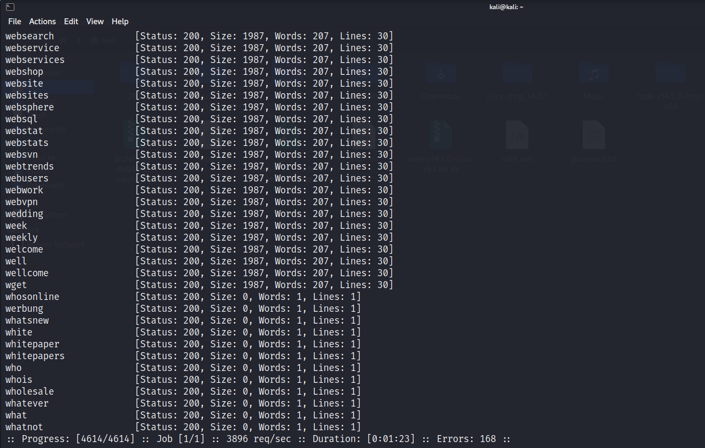

    Dari hasil diatas mendapatkan status 200 dengan size 1987. Lalu saya menerapkan saalah satu string diatas pada browser, disini saya mencoba 1001:

    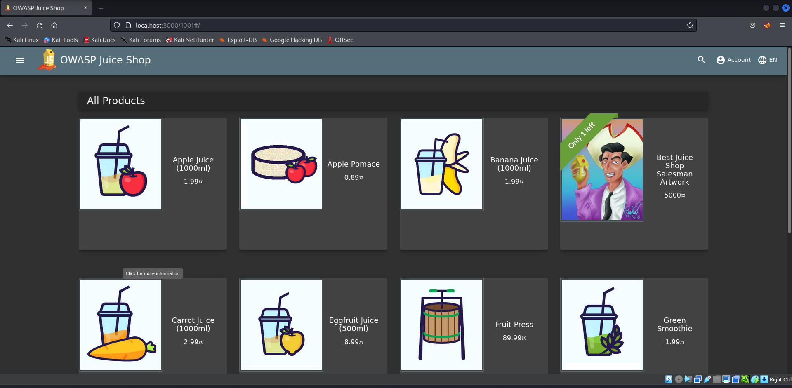

    Pada gambar diatas, mencoba mengakses localhost:3000/1001#/ hasil yang didapatkan adalah halaman list product. KArena string yang saya ambil masih dibawah 1987 dan status serta sizenya masih sama, hal ini memungkinkan bahwa juice shop dapat menerima URL lain dan diarahkan ke list product.

4. Menjalankan fuzzing URL dengan menambahkan perintah '-fs'

   ```$ ffuf -w /usr/share/wordlists/dirb/common.txt -u http://localhost:3000/FUZZ -fs 1987```

    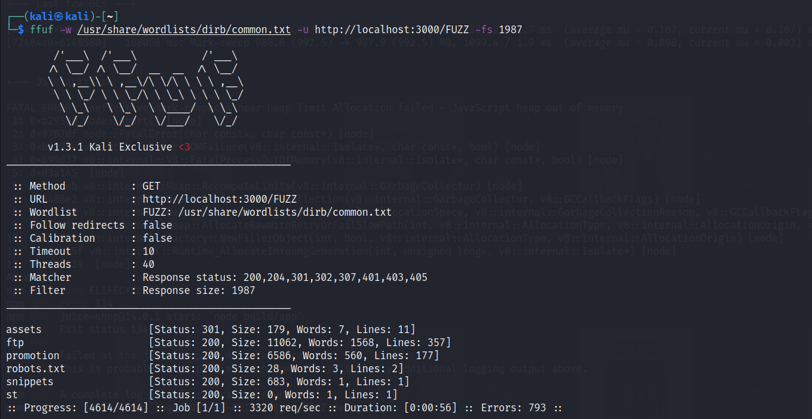

    Ketika command tersebut dijalankan hal itu akan menampilkan size lain dari 1987 karena '-fs' merupakan opsi untuk mengatur filter status HTTP pada respons yang diterima dari target uang di-fuzz. Dan didapatkan assets dan ftp. Mari kita coba di browser :

    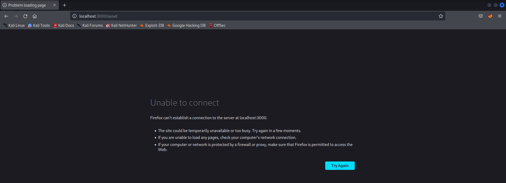

    Pada hasil gambar diatas '/assets' tidak menampilkan hasil apapun.

    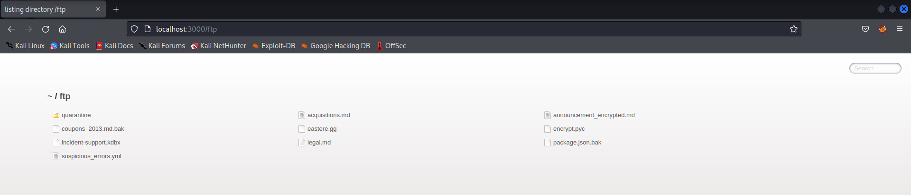

    Pada gambar diatas '/ftp' dimana akan mengakses direktori ftp yang mungkn ada didalam aplikasi. Hal itu memungkinkan kita memiliki file-file yang dapat diakses atau dianalisis dari segi keamanan. Hal ini berguna untuk menguji kelemahan keamanan terkait ftp pada aplikasi juice shop.

5. Menjalankan fuzzing URL dengan manambahkan '/support'

   ```$ ffuf -w /usr/share/wordlists/dirb/common.txt -u http://localhost:3000/supoort/FUZZ -fs 1987```

   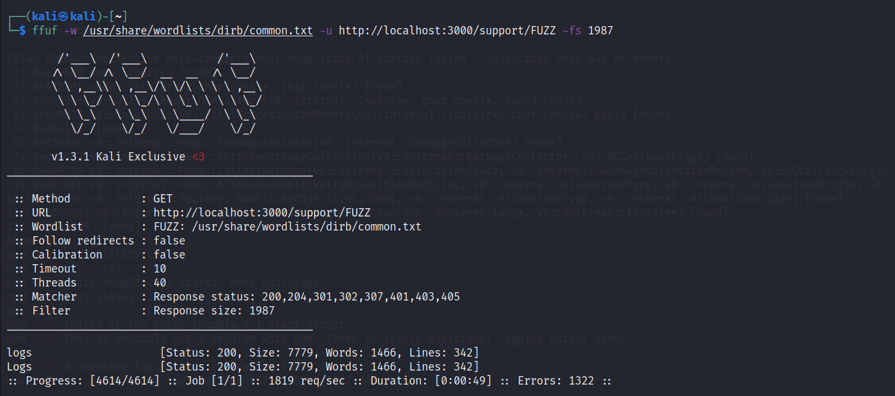

   Hasil dari command diatas didapatkan Logs, mari kita coba jalankan pada browser :

   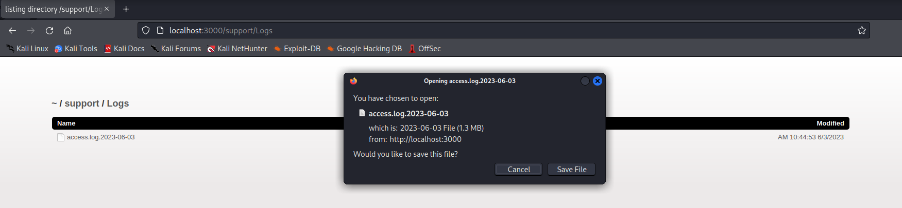

   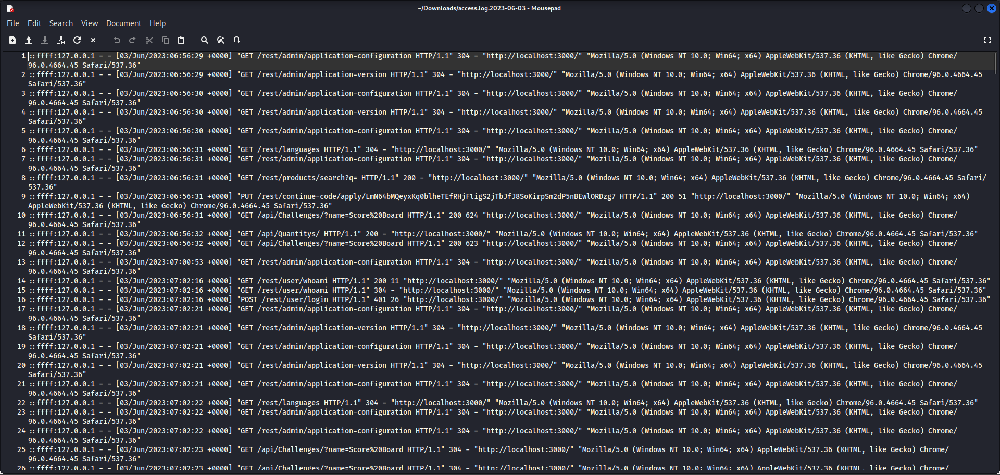

   Setelah dimasukkan ke browser didapati ada akses untuk mendownload file bernama Logs, ketika dibuka isinya seperti gambar kedua diatas. File ini sangat penting dan bersifat rahasia karena memberikan informasi penting tentang aktivitas akses ke sistem.

6. Hasil

    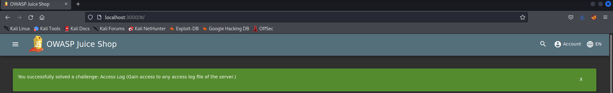

    Kita telah berhasil menyelesaikan access Logs. File Logs berisi catatan aktivitas yang terjadi pada aplikasi berisi informasi penting seperti permintaan HTTP yang diterima, respons yang dikirim, kesalahan yang terajdi, aktivitas pengguna, dll. Penting untuk menjaga keamanan dan integritas file log dengan mengimplementasikan praktik-praktik yang baik seperti menjaga keamanan akses, menganalisis log secara berkala, dan mempertimbangkan penyimpanan jangka panjang untuk keperluan pengawasan dan kepatuhan.

## Percobaan Login dengan username dan Password secara Real

1. File access logs juice shop

    Sebelum melakukan percobaan membutuhkan untuk mencari file access logs juice shop. Disini saya mencari file access log di internet, dapat diakses melalui link berikut ini :

    [Link File Access Logs](https://pastebin.com/4U1V1UjU)

    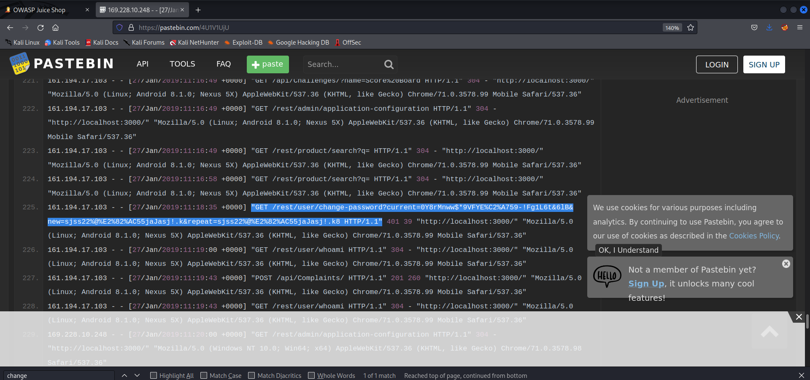

    Dalam acces logs dapat ditemukan salah satu aktivitas mengganti password dnegan menggunakan metode GET dan URL :

    ```GET /rest/user/change-password?current=0Y8rMnww$*9VFYE%C2%A759-!Fg1L6t&6lB&new=sjss22%@%E2%82%AC55jaJasj!.k&repeat=sjss22%@%E2%82%AC55jaJasj!.k8HTTP/1.1```

    Dari URL tersebut dapat dianalisa untuk password yang lama adalah :

    ```0Y8rMnww$*9VFYE%C2%A759-!Fg1L6t&6lB```

    Terdapat '%C2%A7' yang berarti bahwa password sudah di encoding, jadi untuk mendapatkan password yang asli perlu untuk decode password :

    

    Hasil yang didapatkan decode password adalah  :
    
    ```0Y8rMnww$*9VFYE§59-!Fg1L6t&6lB```

2. Login admin

    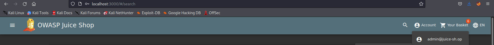

    Disini saya sudah login sebagai admin dengan melakukan injeksi dimana saya memasukkan username : admin' or 1=1-- password : admin. Selanjutnya saya akan mengakses halaman '/administration'

    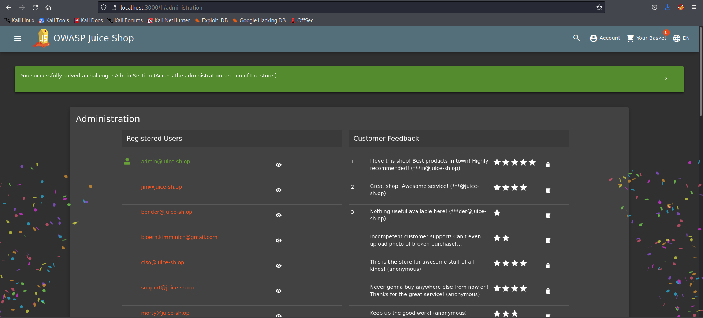

3. Mencocokkan username dan password menggunakan burp-suite

    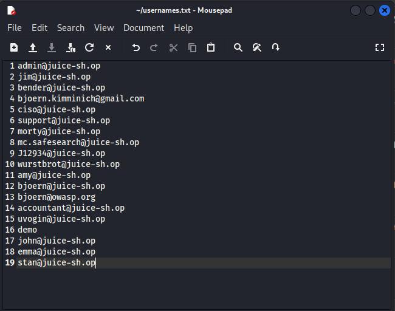

    Disini saya mengambil username yang tertera pada halaman '/administration' saya simpan dengan file beranama  'usernames.txt'. Selanjutnya buka burp suite dan masuk ke fitur HTTP History, cari login lalu kirim ke intruder.

    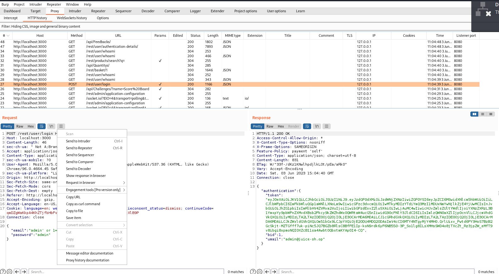

    Pada gambar diatas terlihat bahwa kita login dengan terdapat username dan password. Langkah selanjutnya kita kirim request ke intruder.

    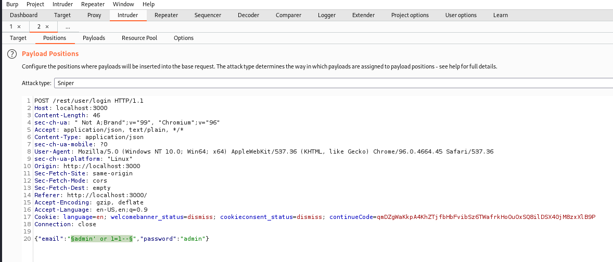

    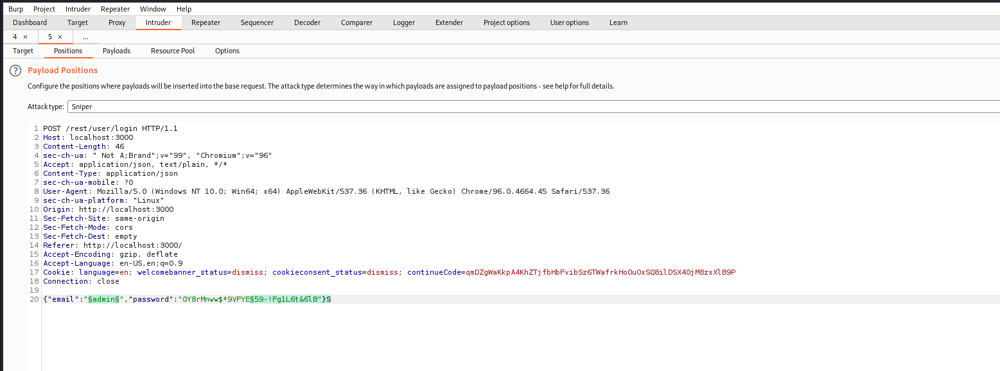

    Pada intruder clear $ agar bersih dari target attack, selanjutnya pilih saya username untuk dijadikan target karena kita akan cek attack untuk username. Disini jangan lupa saya juga mengganti password yang sudah saya decode tadi yaitu '0Y8rMnww$*9VFYE§59-!Fg1L6t&6lB'. Pastikan pada fitur target sudah benar bahwa kita menargetkan website dari juice shop yaitu 'localhost:3000'. Selanjutnya kita beralih ke fitur payloads.

    

    Pada payloads inputkan file 'usernames.txt' lalu start attack. Untuk hasil didapatkan status 401, hal itu karena terdapat perubahan password yang diinputkan hal ini mungkin dikarenakan password berisi karakter '$'.

4. Mencoba mencocokkan secara manual

    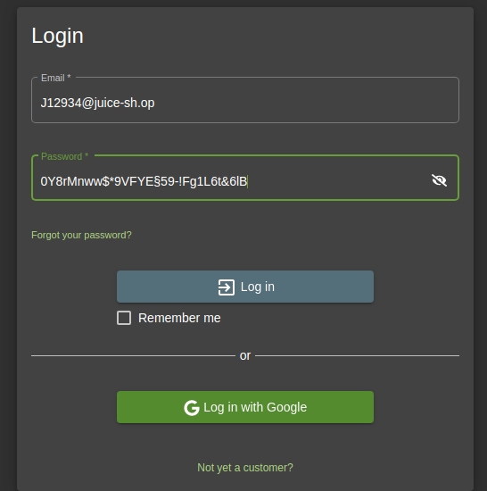

    Disini saya menginputkan username : J12934@juice-sh.op dan password : 0Y8rMnww$*9VFYE§59-!Fg1L6t&6lB lalu klik Login.

5. Hasil

    

    Ternyata dengan username dan password yang saya inputkan berhasil masuk dan login sebagai user J12394@juice-sh.op
