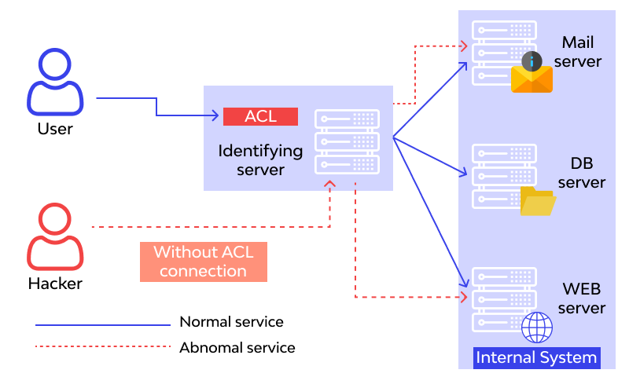

## Cover

<h3 align="center">
    <b>Praktikum Keamanan Jaringan</b> 
    Broken Access Control (OWASP 10 Juice Shop)
</h3>
 

  

 

    Dosen Pembimbing: 
    Ferry Astika Saputra, S.T., M.Sc.

 

    Disusun Oleh: 
    Septiana Dyah Anissawati (3122640031)

 

    <b>
        KELAS D4 LJ IT B  
        JURUSAN D4 LJ TEKNIK INFORMATIKA B 
        DEPARTEMEN TEKNIK INFORMATIKA DAN KOMPUTER   
        POLITEKNIK ELEKTRONIKA NEGERI SURABAYA  
        2023
    </b>

 

## Laporan

## Broken Access Control

Broken access control adalah celah keamanan pada sebuah sistem yang memungkinkan pengguna atau entitas yang tidak sah untuk mendapatkan akses ke sumber daya yang harusnya tidak dapat diakses. Contoh sumber daya yang terkait dengan kontrol akses meliputi halaman web, data, file, dan fungsi sistem.

Contoh kasus "broken access control" yang terkait dengan user normal adalah ketika sebuah sistem memiliki daftar kontrol akses (ACL) yang tidak teratur, sehingga pengguna normal mampu mengakses sumber daya yang seharusnya hanya dapat diakses oleh pengguna yang memiliki hak istimewa. Misalnya, sebuah situs web yang memiliki beberapa level akses seperti "admin", "user", dan "guest". Jika sistem tersebut tidak memeriksa secara cermat hak akses pengguna dan membiarkan pengguna "normal" (seperti "guest" atau "user") untuk mengakses data yang seharusnya hanya dapat diakses oleh "admin", maka hal ini akan menjadi contoh dari "broken access control".

Situasi seperti ini dapat mengakibatkan kerentanan keamanan, karena pengguna yang tidak memiliki hak istimewa mungkin dapat mengakses atau bahkan mengubah data sensitif, seperti informasi pribadi atau keuangan, serta merusak atau menghapus data yang seharusnya hanya dapat diakses oleh pengguna tertentu. Oleh karena itu, sangat penting untuk memeriksa dan memastikan bahwa daftar kontrol akses teratur dan hanya memberikan akses yang diperlukan pada setiap tingkatan akses.

Jika seorang hacker berhasil masuk ke dalam sistem tanpa melalui mekanisme kontrol akses yang terdefinisi (misalnya dengan menemukan celah atau kerentanan dalam sistem), maka itu disebut sebagai "abnormal service" atau biasanya dikenal sebagai "unauthorized access". Jika hacker berhasil melakukan "unauthorized access" ke dalam sistem yang memiliki kontrol akses yang rusak atau tidak teratur, maka mereka mungkin dapat menembus server mail atau web server melalui akses yang tidak sah.

Ketika seorang hacker berhasil masuk ke dalam sistem dengan cara seperti itu, maka mereka mungkin akan mencoba mencari celah atau kerentanan lain dalam sistem untuk memperoleh hak istimewa yang lebih tinggi atau mendapatkan akses yang lebih besar. Sebagai contoh, mereka mungkin mencoba mengambil alih akun administrator atau memanipulasi database sistem.

Untuk mencegah jenis serangan ini, sangat penting untuk memiliki sistem kontrol akses yang kuat dan teratur, serta melakukan pemeriksaan keamanan secara teratur untuk mengidentifikasi dan memperbaiki kerentanan dalam sistem. Selain itu, upaya untuk mencegah "unauthorized access" juga harus dilakukan, seperti membatasi akses ke sistem hanya untuk pengguna yang memiliki hak istimewa, mengimplementasikan kebijakan keamanan yang kuat, dan memantau aktivitas pengguna secara teratur untuk mendeteksi tindakan yang mencurigakan.

## Burpsuite

Juice Shop adalah aplikasi web yang dibuat khusus untuk mengajarkan pengguna tentang keamanan aplikasi web dan memperkenalkan berbagai jenis serangan yang sering dilakukan oleh penyerang. Aplikasi ini dibuat dengan tujuan memberikan pengalaman "hands-on" dalam menguji kerentanan dan melakukan serangan pada aplikasi web.

Burp Suite adalah alat pentesting yang sering digunakan untuk menguji keamanan aplikasi web. Alat ini memiliki berbagai fitur yang dapat membantu dalam mengidentifikasi dan mengeksploitasi kerentanan pada aplikasi web. Burp Suite dapat digunakan untuk memindai aplikasi web dan mengidentifikasi kerentanan, mencoba mengambil alih sesi pengguna, serta melakukan serangan lainnya.

Dalam mengakses Juice Shop, pengguna dapat menggunakan Burp Suite sebagai alat untuk melakukan serangan dan menguji kerentanan pada aplikasi tersebut. Alat ini memungkinkan pengguna untuk mengamati dan memodifikasi data permintaan dan respon yang dikirimkan antara aplikasi web dan server, serta mengidentifikasi kerentanan seperti SQL injection, cross-site scripting (XSS), dan broken authentication.

Selain itu, pengguna juga dapat menggunakan Burp Suite untuk memantau dan merekam aktivitas pengguna saat berinteraksi dengan aplikasi Juice Shop, yang kemudian dapat digunakan untuk menganalisis dan menguji keamanan aplikasi secara lebih mendalam.

Oleh karena itu, pengguna disarankan untuk menggunakan Burp Suite saat mengakses Juice Shop, karena alat ini dapat membantu dalam mengidentifikasi dan mengeksploitasi kerentanan pada aplikasi web dan memperluas pemahaman pengguna tentang keamanan aplikasi web. Berikut adalah beberapa fungsi utama dari Burp Suite:

1.	Intercepting proxy: Burp Suite memiliki fitur intercepting proxy yang memungkinkan pengguna untuk memantau dan memodifikasi data yang dikirimkan antara aplikasi web dan server. Dengan fitur ini, pengguna dapat memodifikasi permintaan dan respon yang dikirimkan antara aplikasi web dan server untuk menguji keamanan aplikasi.
2.	Scanner: Burp Suite memiliki fitur scanner yang dapat digunakan untuk melakukan pemindaian (scanning) kerentanan pada aplikasi web. Dengan fitur ini, Burp Suite dapat melakukan pemindaian otomatis pada aplikasi web untuk mengidentifikasi kerentanan seperti SQL injection, cross-site scripting (XSS), dan kerentanan lainnya.
3.	Intruder: Burp Suite memiliki fitur Intruder yang dapat digunakan untuk melakukan serangan brute-force atau fuzzing pada aplikasi web. Dengan fitur ini, Burp Suite dapat mengirimkan serangkaian permintaan yang berbeda ke aplikasi web untuk menguji keamanannya.
4.	Repeater: Burp Suite memiliki fitur repeater yang memungkinkan pengguna untuk mengirimkan permintaan yang sama berulang kali ke server untuk menguji respons dari server. Dengan fitur ini, pengguna dapat memodifikasi permintaan untuk menguji respons dari server.
5.	Collaborator: Burp Suite memiliki fitur Collaborator yang dapat digunakan untuk menguji kerentanan pada aplikasi web yang terhubung dengan sumber eksternal (misalnya, server email, server DNS, dan sebagainya). Dengan fitur ini, pengguna dapat menguji apakah aplikasi web mengirimkan informasi rahasia ke sumber eksternal.
6.	Decoder: Burp Suite memiliki fitur decoder yang dapat digunakan untuk memecahkan kode atau enkripsi yang digunakan pada aplikasi web. Dengan fitur ini, pengguna dapat mengidentifikasi jenis enkripsi yang digunakan pada aplikasi web dan melakukan uji coba untuk melihat seberapa mudahnya untuk memecahkan enkripsi tersebut.

### A. Cek Kelengkapan

1. Cek Versi Java

Pada sistem operasi saya sudah terinstal java versi 17 dengan bergitu minimum requirement sudah terpenuhi.

2. Cek Burpsuite

Buka burpsuite yang sudah ada di sistem operasi.

3. Jalankan OWASP 10 Juice Shop

4. Buka Burpsuite

5. Buka OWASP 10 Juice Shop

Pertama akan dilakukan ngetrace dari HTPP request, memilih proxy dan pilih HTPP history. Setelah itu buka browser dan membuka halaman juice shop (http://localhost:3000/)

Setelah login saya menambahkan 1 apple pomance dan 1 apple pomace delama keranjang di juice shop.

### B. View Basket  

1. Pergi ke burpsuite, pilih tab proxy > HTTP Proxy

    

    Setelah itu buka burp suite dan trace requestnya, pilih trace yang mendapatakan response GET dengan status 200 maka akan ditampilkan isi keranjang yang sudah di masukkan tadi.

2. Pergi ke burp suite, pada tab Repeater

    

    Setelah itu maka akan keluar informasi, jika dilihat request yaitu menggunakan API dan usernya adalah 6. Lalu dilanjutkan dengan mengirim request ke repeater dan terlihat terdapat 2 item yaitu apple pomace da apple juice.

3. Langkah selanjutnya mengubah id user pada API Request

    

    Selanjutnya saya mencoba nengubah id user dari API request, disini saya mengubah ke id user 2, maka akan terlihat basket untuk id user nomor 2. Selanjutnya buka fitur intercept yang ada di burpsuite, aktifkan fitu intercept dan di juice shop tekan home page dan tekan basket. Kemudian terlihat request basket, dan saya mencoba mengubah id user menjadi 2 lalu klik forward.

4. Hasil

    

    Maka di browser akan tertampil basket dari user dengan id 2.

### C. Basket Manipulate   

Tahap ini akan memanipulasi isi basket dari user lain, berikut hasilnya.

### D. Admin Section   

Pada tahap ini akan login ke halaman admin.

1.	Buat file.txt yang berisikan password random

    

    Pertama buat terlebih dahulu file.txt dengan mengisi password random, dan disini saya menulis 20 password random.

2.	Review produk

    

    Selanjutnya saya mencari tahu terlebih dahulu mengetahui email dari admin, disini saya menemukan email admin di salah satu item yang memiliki reviews.

3.	Buka burp suite, pilih tab Target > Scope

    

4.	Pilih tab Proxy > Options

    

    Pada proxy setting centang “Is In Target Scope”. Selanjutnya kembali ke halaman login, masukkan email dan password dari admin dengan mengisi password secara random. Sebelum klik login aktifkan intercept dan tekan login.

5.	Pilih Proxy > Intercept on

    

    Pada intercept klik forward maka akan keluar admin dan password yang telah diinputkan tadi.

6. Pilih Intruder > Payload

    

    Kemudian kirim ke intruder, bersihkan target untuk semua burte force dengan menekan clear.

7. Spesifikasi target password

    

    Setelah itu pilih target burtforce yang mana adalah password dan tekan add.

8. Burte Force

    

    Pada menu playload, inputkan file.txt yang sudah dibuat tadi sebagai password bank yang nanti akan digunakan untuk burte force.

9. Start Attcaks

    

10. Mencari password yang benar

    

    Pada data password maka akan diperoleh satu password yang mana memiliki status 200 artinya password tersebut merupakan password admin yang telah dicek secara status internet.

11. Hasil

    

## KESIMPULAN

Percobaan broken access control pada Juice Shop adalah upaya untuk mengeksplorasi dan menemukan kerentanan pada sistem kontrol akses yang digunakan oleh aplikasi Juice Shop. Dalam percobaan ini, peneliti keamanan mencoba untuk memanipulasi atau mengakali aplikasi agar dapat mengakses sumber daya atau informasi yang seharusnya tidak dapat diakses oleh pengguna yang tidak memiliki hak akses yang sesuai.

Beberapa jenis kerentanan yang dapat ditemukan melalui percobaan ini termasuk kelemahan pada proses autentikasi dan otorisasi, seperti masalah dengan pengelolaan sesi, pencarian buruk, validasi input yang tidak memadai, dan banyak lagi. Jika berhasil dieksploitasi, kerentanan tersebut dapat memungkinkan penyerang untuk memperoleh informasi sensitif, mengubah data, atau bahkan mendapatkan akses penuh ke aplikasi Juice Shop.

Tujuan dari percobaan broken access control pada Juice Shop adalah untuk membantu meningkatkan keamanan aplikasi tersebut dengan menemukan dan melaporkan kerentanan yang ditemukan kepada tim pengembang. Dengan demikian, pengguna dapat merasa lebih aman dan terlindungi saat menggunakan aplikasi Juice Shop.
