## Cover

<h3 align="center">
    <b>Praktikum Keamanan Jaringan</b> 
    Injection (OWASP 10 Juice Shop)
</h3>
 

  

 

    Dosen Pembimbing: 
    Ferry Astika Saputra, S.T., M.Sc.

 

    Disusun Oleh: 
    Septiana Dyah Anissawati (3122640031)

 

    <b>
        KELAS D4 LJ IT B  
        JURUSAN D4 LJ TEKNIK INFORMATIKA B 
        DEPARTEMEN TEKNIK INFORMATIKA DAN KOMPUTER   
        POLITEKNIK ELEKTRONIKA NEGERI SURABAYA  
        2023
    </b>

 

## Laporan

## Injection

OWASP Juice Shop adalah sebuah aplikasi web yang dikembangkan oleh OWASP (Open Web Application Security Project) sebagai platform latihan dan pembelajaran untuk mengidentifikasi dan memahami celah keamanan dalam pengembangan aplikasi web. OWASP Top Ten adalah daftar sepuluh risiko keamanan aplikasi web yang paling kritis yang dirilis oleh OWASP.

Injection merupakan salah satu dari sepuluh risiko keamanan tersebut. Injection terjadi ketika penyerang dapat memasukkan atau "menyuntikkan" kode berbahaya (misalnya, SQL, NoSQL, OS, atau LDAP) ke dalam sistem yang rentan melalui input yang tidak divalidasi atau disaring dengan baik. Dalam konteks OWASP Juice Shop, ini berarti penyerang dapat menyuntikkan kode berbahaya ke dalam aplikasi untuk mengakses data yang seharusnya tidak dapat diakses, mengubah data, atau bahkan mengontrol sistem.

Sebagai contoh, SQL Injection adalah bentuk umum dari injection, di mana penyerang memasukkan perintah SQL berbahaya ke dalam input yang tidak divalidasi dengan benar. Jika sistem rentan terhadap serangan ini, perintah SQL yang disuntikkan dapat dieksekusi, memungkinkan penyerang mengakses, memodifikasi, atau menghapus data dalam database.

Untuk mengurangi risiko injection, pengembang harus:

1. Menggunakan prepared statements atau parameterized queries untuk melindungi terhadap SQL Injection.
2. Melakukan validasi input dengan benar dan membatasi karakter yang diperbolehkan untuk setiap input.
3. Menggunakan fitur escaping yang tepat untuk mencegah eksekusi kode berbahaya.
4. Menerapkan prinsip principle of least privilege, di mana setiap komponen sistem memiliki akses minimal yang diperlukan untuk menjalankan fungsinya.
5. Secara berkala memeriksa dan memperbarui perangkat lunak dan pustaka yang digunakan untuk memastikan celah keamanan yang diketahui telah ditangani.

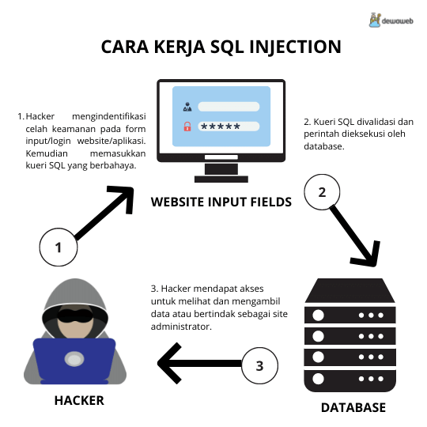

### Skenario 1 
### String query = "SELECT \* FROM accounts WHERE custID='" + 
request.getParameter("id") + " ' ";

Serangan injection yang mungkin terjadi pada kode ini adalah SQL Injection. Pada serangan ini, attacker dapat memanipulasi input parameter "id" untuk menyuntikkan kode SQL yang tidak sah ke dalam string query, seperti mengganti nilai "id" dengan "1' OR 1=1 --" yang akan mengubah string query menjadi "SELECT * FROM accounts WHERE custID='1' OR 1=1 --'", dan ini akan mengeksekusi perintah SQL yang tidak diinginkan.

### Skenario 2
### Query HQLQuery = session.createQuery("FROM accounts WHERE custID='" + request.getParameter("id") + " ' ");
Serangan injection yang mungkin terjadi pada kode ini adalah HQL Injection. Pada serangan ini, attacker dapat memanipulasi input parameter "id" untuk menyuntikkan kode HQL yang tidak sah ke dalam query, seperti mengganti nilai "id" dengan "1' OR 1=1 --" yang akan mengubah query menjadi "FROM accounts WHERE custID='1' OR 1=1 --'", dan ini akan mengeksekusi query HQL yang tidak diinginkan. Dalam kedua skenario , penyerang mengubah nilai parameter 'id' di browser mereka untuk mengirim: 'UNION SLEEP(10);--
http://example.com/app/accountView?id=' UNION SELECT SLEEP(10);--
attacker mencoba melakukan serangan SQL Injection dengan memasukkan payload ' UNION SELECT SLEEP(10);-- ke dalam parameter "id". Payload ini akan menggabungkan query asli dengan query yang ditambahkan oleh attacker, yaitu SELECT SLEEP(10), yang akan menunda eksekusi query sebelumnya selama 10 detik. Tanda "--" digunakan untuk mengakhiri query asli dan mengabaikan karakter lain yang mungkin ada pada query. Ini mengubah arti dari kedua Query untuk mengembalikan semua rekaman dari tabel akun. Serangan yang lebih berbahaya dapat mengubah atau menghapus data atau bahkan menjalankan prosedur tersimpan.Untuk mencegah serangan injeksi, pengembang harus menerapkan praktik pengkodean yang aman dan menggunakan kueri berparameter atau pernyataan yang disiapkan untuk memvalidasi dan membersihkan input pengguna. Selain itu, validasi masukan dan penyandian keluaran harus dilakukan untuk memastikan bahwa masukan 
pengguna diformat dan ditampilkan dengan benar untuk mencegah serangan skrip lintas situs (XSS). Juga disarankan untuk menggunakan alat seperti firewall aplikasi web (WAF) dan pemindai kerentanan untuk mengidentifikasi dan mengurangi potensi kerentanan injeksi.

## Login Admin

1. Masuk ke halaman Juice Shop dan lakukan login admin

    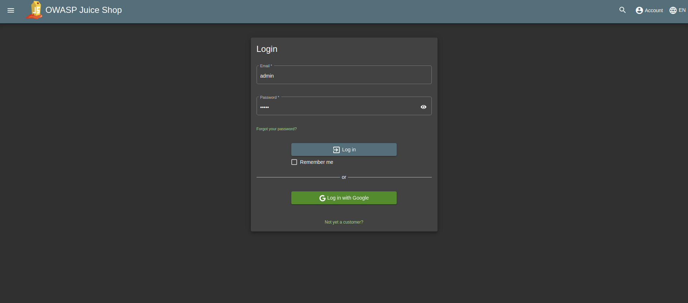

    Pertama-tama masukkan email dan password terlebih dahulu.

2. Check menu Proxy -> HTTP-history

    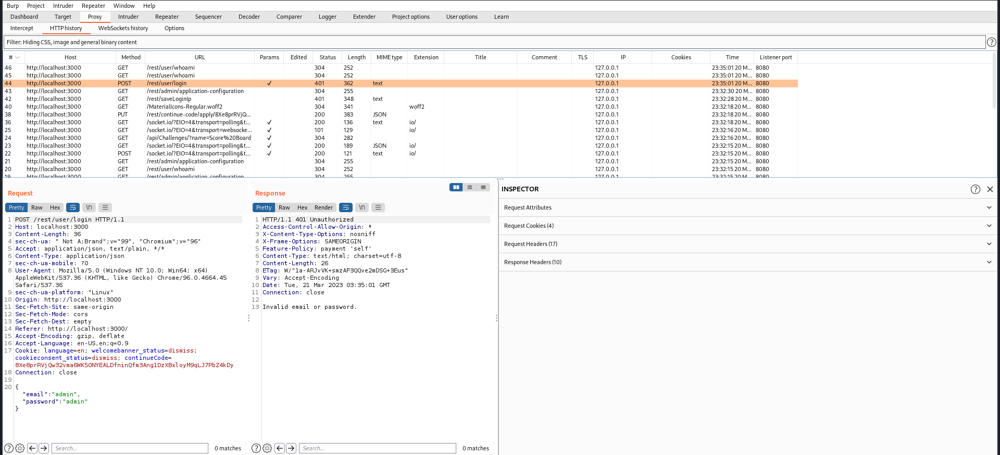

    Terlihat bahwa email dan password yang dimasukkan tadi tidak dapat masuk ke halaman admin, ada keterangan email or password invalid.

3. Masuk ke halaman Repeater

    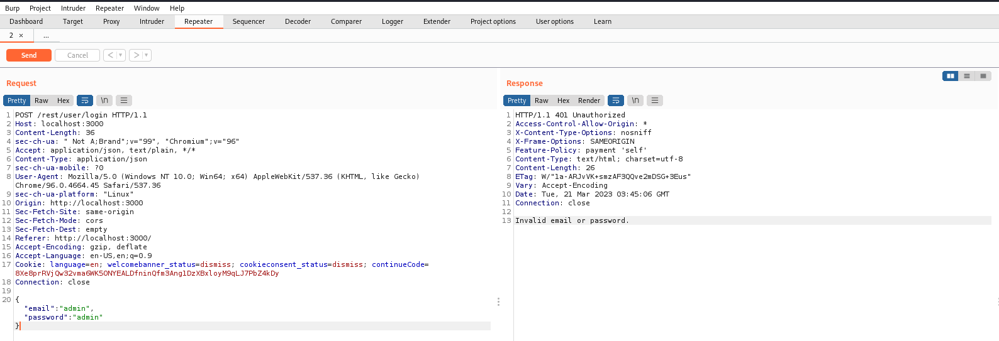

4. Memodifikasi request di Repeater

    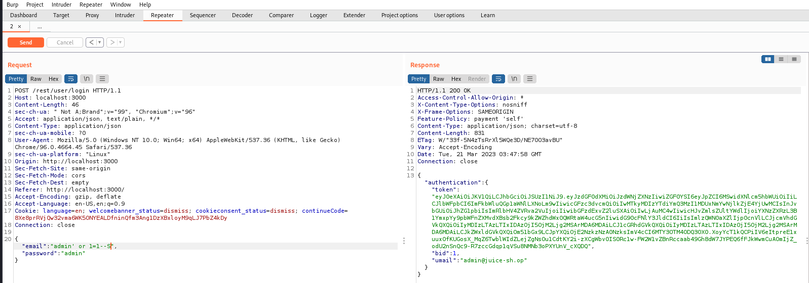

    Menambahkan email 'admin' menjadi "admin' or 1=1--" lalu mendapatkan token beserta email asli dari admin juice shop.

5. Login user dengan email modifikasi

    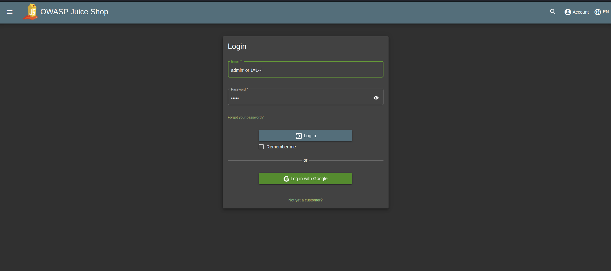

6. Hasil

    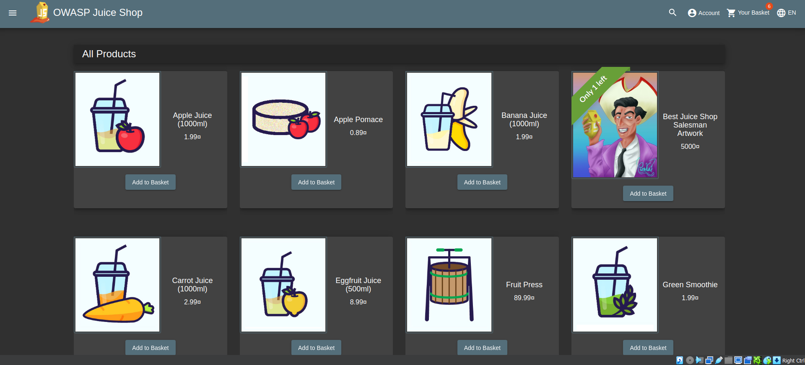

## Login Bender

1. Buka terminal lalu burpsuite dan browser untuk mengakses halaman juice shop

2. Masuk ke burpsuite Proxy -> HTTP-History untuk melihat hasil request dan response /rest/admin/application-configuration

    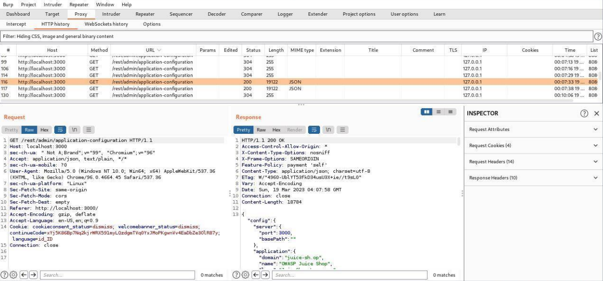

    Response tersebut memberikan informasi terkait website juice-shop, informasi tersebut antara lain domain email dari akun yang ada dalam OWASP Juice Shop.

3. Login juice shop menggunakan email bender@juice-sh.op dengan password random

    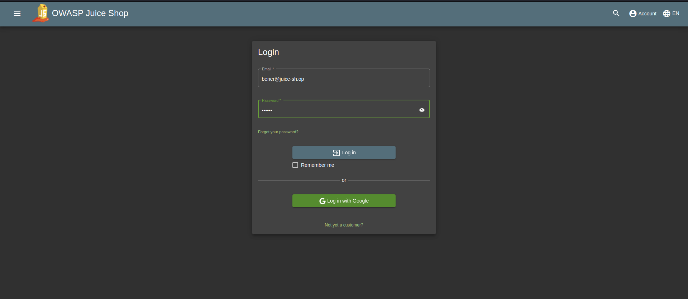

4. Masuk ke Proxy -> HTTP History

    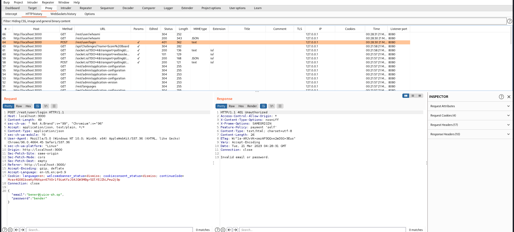

5. Menyimpan baris data request ke file txt

    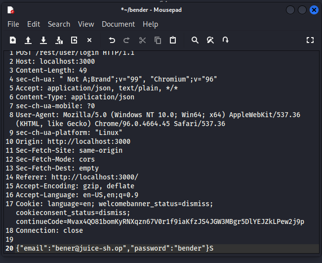

6. SQL MAP

    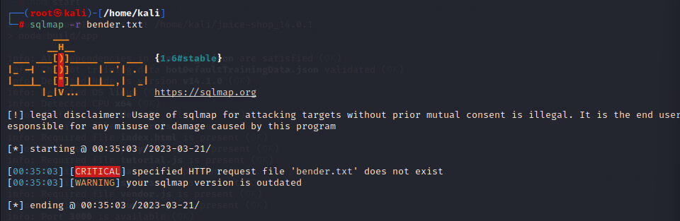

    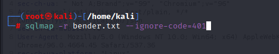

7. Send to Reepeater

    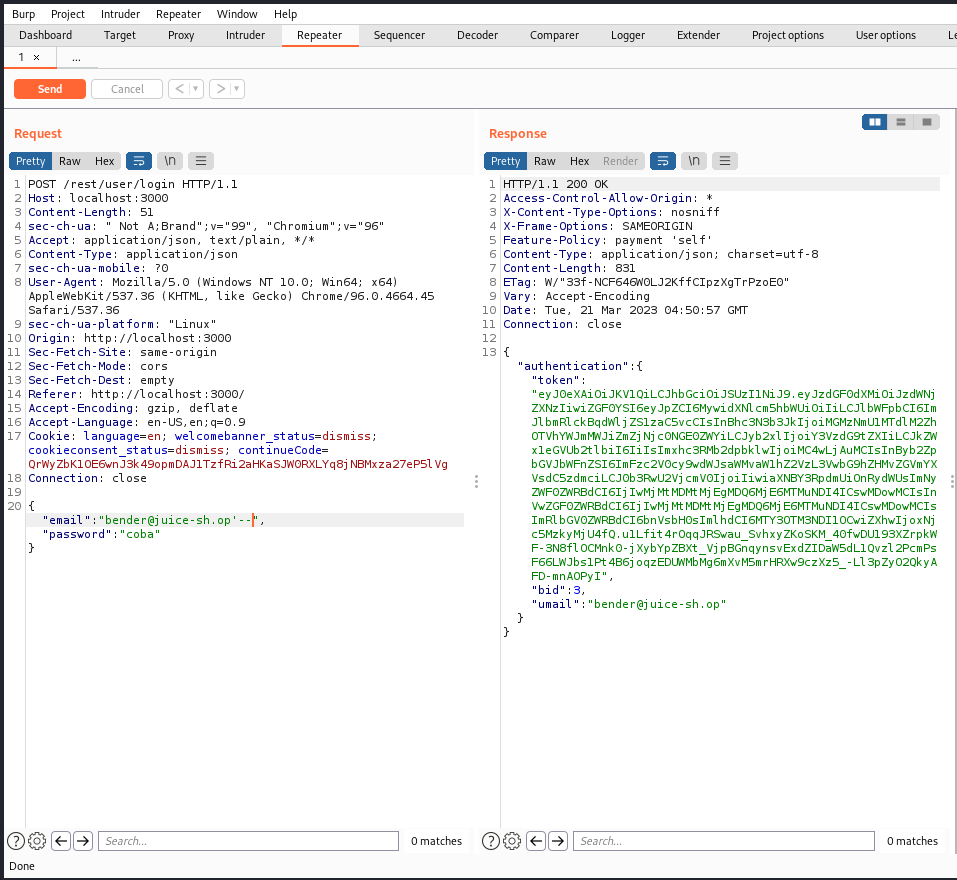

    Melakukan penambahan karakter setelah email bender yaitu '-- yang merubah response menjadi 200

8. Hasil

    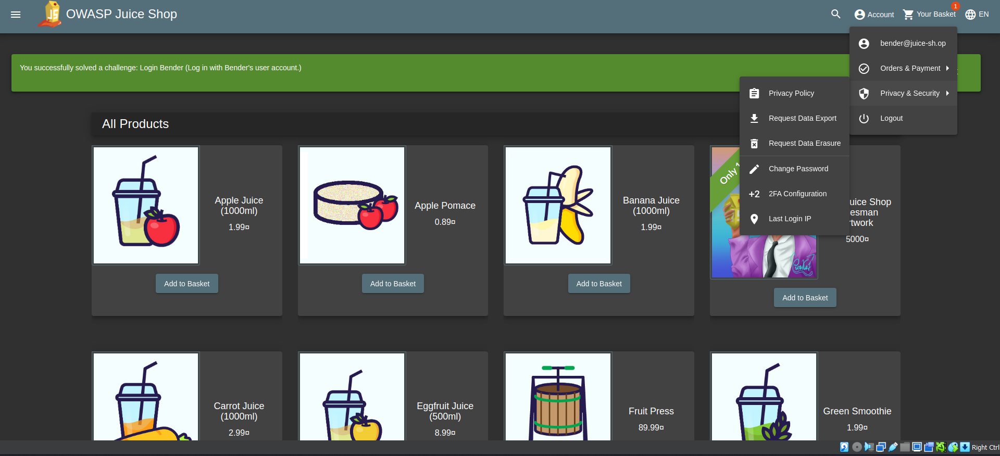

    Login dengan menggunakan email penambahan karakter dan random password maka akan terlihat dapat masuk ke halaman bender di juice shop.

## SOAL

1. Contoh form yang mengimplementasikan input sanitation menghindari input karakter yang mengandung sql injeksi
Jawab :
- Form pendaftaran / register pasti terdapat beberapa imputan seperti nama, pengguna, kata sandi, alamat, email, dll, lalu menjalani proses sanitasi sebelum disimpan kedalam database. Fungsi sanitasi disediakan oleh framework atau library seperti `htmlspecialchars()` atau `filter_input()` dalam PHP, untuk membersihkan karakter khusus yang dapat digunakan dalam serangan SQL injection.
- Form pencarian/search, komentar/pengumuman dan URL parameter, jika pengguna dapat mengirim komentar atau pengumuman, pastikan untuk membersihkan atau melarang menggunakan karakter khusus seperti tanda kutip tunggal ('), tanda kutip ganda ("), atau karakter escape () yang dapat digunakan dalam serangan SQL injection.

2. Apa yang terjadi ketika injeksi sql diinputkan didalam database
Jawab :
- manipulasi data
- kerusakan struktur database
- downtime dan ketidak stabilan sistem

3. Perbedaan injection dan sql injection, injection - lebih luas contohnya 
Jawab :
Injection merupakan serangan yang dilakukan dengan memasukkan kode yang tidak aman atau tidak diharapkan ke dalam inputan dari sebuah aplikasi.
SQL Injection adalah serangan injection yang spesifik terhadap aplikasi atau sistem yang menggunakan bahasa SQL untuk berinteraksi dengan database.
