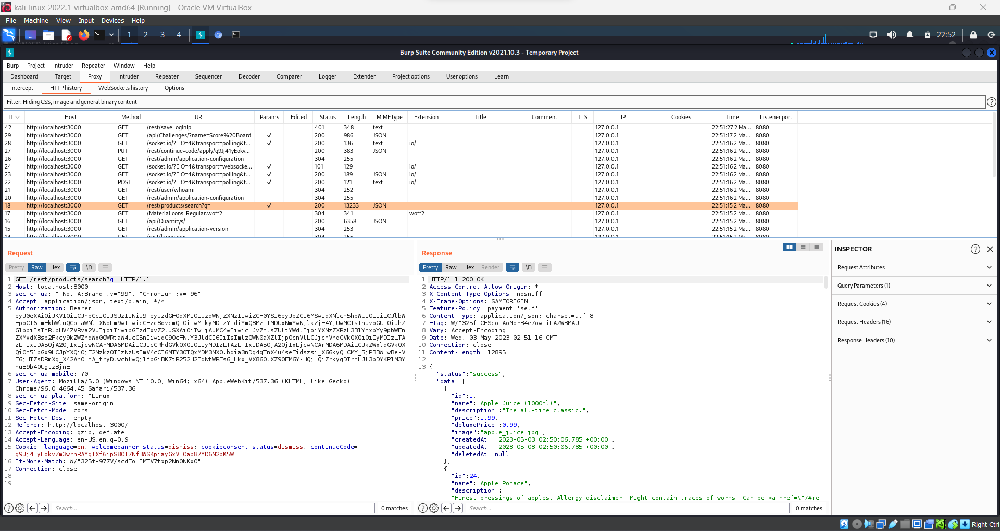
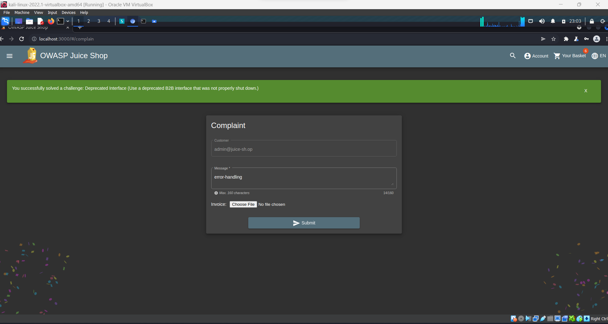

## Cover

<h3 align="center">
    <b>Praktikum Keamanan Jaringan</b> 
    Security Misconfiguration
</h3>
 

  

 

    Dosen Pembimbing: 
    Ferry Astika Saputra, S.T., M.Sc.

 

    Disusun Oleh: 
    Septiana Dyah Anissawati (3122640031)

 

    <b>
        KELAS D4 LJ IT B  
        JURUSAN D4 LJ TEKNIK INFORMATIKA B 
        DEPARTEMEN TEKNIK INFORMATIKA DAN KOMPUTER   
        POLITEKNIK ELEKTRONIKA NEGERI SURABAYA  
        2023
    </b>

 

## Laporan

## Security Misconfiguration

Security Misconfiguration adalah salah satu dari sepuluh risiko keamanan yang terdapat dalam OWASP Top 10. Security misconfiguration terjadi ketika sistem atau aplikasi diatur secara salah atau tidak aman, sehingga memberikan kesempatan bagi penyerang untuk menemukan celah dan menyerang sistem atau aplikasi tersebut.

Ketika pengembang tidak mengikuti dokumentasi sebuah library, framework atau komponen aplikasi lainnya, tidak menerapkan standart konfigurasi yang ada, akan membuat aplikasi memiliki beberapa celah yang akan dimanfaatkan attacker.

Ada beberapa hal yang menyebabkan sering terjadi akibat dari miskonfigurasi:

    1. HTTP Only
    2. Query Builder
    3. X-Frame-options
    4. Content-Security Policy
    5. CORS
    6. Acces Control
    7. dll….

Berikut adalah contoh Security Misconfiguration dalam aplikasi website OWASP Juice Shop:

### A. Error Handling
Memunculkan error, namun error yang ditampilkan tidak dikemas secara konsisten.

1. Buka Aplikasi Burp Suite

    

2. Membuka browser dan masuk ke halaman utama web OWASP Juice Shop

    

3. Buka kembali burp suite, cari request baru /rest/product/search

    

4. Masukkan payload /rest/product/search ke repeater lalu ubah endpoint menjadi text random kemudian send

    

     

    Ada response error 500 atau internal server error dimana pesan error sangat panjang dan tidak rapi.

### B. Deprecated Interface
Menggunakan antarmuka B2B kuno yang tidak dinonaktifkan dengan benar

1. Pada halaman utama, klik menu sidebar dan pilih Complaint

    

2. Mengisi form dan masukkan file dengan format .xml

    

3. Hasil

    

4. Melihat proxy pesan error pada burp suite

    