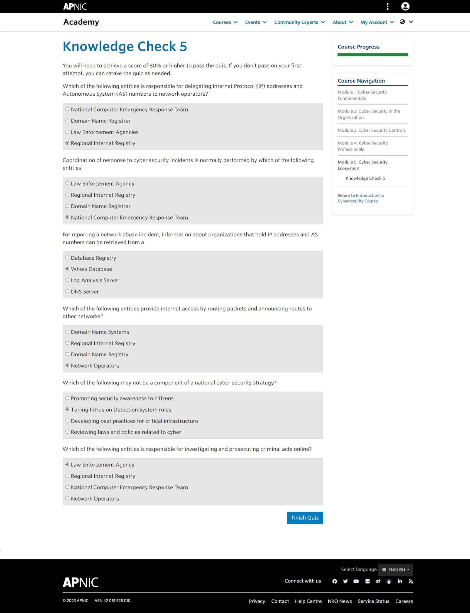

## Cover

<h3 align="center">
    <b>Keamanan Jaringan</b> 
    Resume Cyber Security Ecosystem
</h3>
 

  

 

    Dosen Pembimbing: 
    Ferry Astika Saputra, S.T., M.Sc.

 

    Disusun Oleh: 
    Septiana Dyah Anissawati (3122640031)

 

    <b>
        KELAS D4 LJ IT B  
        JURUSAN D4 LJ TEKNIK INFORMATIKA B 
        DEPARTEMEN TEKNIK INFORMATIKA DAN KOMPUTER   
        POLITEKNIK ELEKTRONIKA NEGERI SURABAYA  
        2023
    </b>

 

## ESSAY

Cybersecurity merupakan upaya untuk melindungi sistem dan jaringan komputer dari serangan atau kejahatan cyber. Dalam era digital seperti sekarang ini, risiko keamanan cyber semakin meningkat dan dapat berdampak buruk bagi individu, perusahaan, maupun negara. Oleh karena itu, memahami dan mengimplementasikan keamanan cyber menjadi sangat penting. Pada essay ini, saya akan membahas tentang ekosistem keamanan cyber dan bagaimana membangun ekosistem keamanan cyber yang baik dan terintegrasi.

Melindungi sistem informasi pemerintah dan infrastruktur kritis dari serangan siber. Infrastruktur kritis dapat mencakup sistem keamanan nasional, sistem keuangan, sistem transportasi, sistem kesehatan, dan lain sebagainya. Perlindungan ini sangat penting untuk memastikan bahwa informasi penting dan infrastruktur vital tetap aman dan berjalan dengan lancar, serta untuk mencegah serangan siber yang dapat mengganggu layanan publik dan keamanan nasional.

Pemerintah Indonesia telah menyadari betapa pentingnya keamanan siber dalam menjaga informasi pemerintah dan infrastruktur kritis dari serangan siber. Oleh karena itu, pemerintah telah membentuk Cyber Government Indonesia (CGI) sebagai badan yang bertanggung jawab untuk melindungi sistem informasi pemerintah dan infrastruktur kritis dari serangan siber. CGI telah mengembangkan kebijakan keamanan siber, melakukan pemantauan terhadap ancaman siber, serta memberikan pelatihan dan edukasi kepada masyarakat mengenai keamanan siber. Dengan adanya CGI, diharapkan keamanan siber di Indonesia dapat terus ditingkatkan sehingga dapat meminimalisasi risiko serangan siber pada informasi pemerintah dan infrastruktur kritis.

Sementara untuk penanggung jawab utama keamanan siber atau cyber security di Indonesia adalah Badan Siber dan Sandi Negara (BSSN), yang merupakan badan otonom di bawah dan bertanggung jawab langsung kepada Presiden Republik Indonesia. BSSN didirikan pada tahun 2017 dan berada di bawah Kementerian Koordinator Bidang Politik, Hukum, dan Keamanan. BSSN memiliki mandat untuk melindungi kepentingan negara dari ancaman siber, melindungi sistem informasi pemerintah, dan mengkoordinasikan keamanan siber nasional. BSSN juga berfungsi sebagai pusat keamanan siber nasional dan pusat pengendalian keamanan siber untuk sektor pemerintah dan kritis nasional.

Didalam BSSN terdapat beberapa lembaga pembentuk lainnya meliputi Direktorat Keamanan Informasi Kemenkominfo merupakan bagian dari BSSN yang fokus pada pengamanan sistem informasi pemerintah, sedangkan Id-SIRTII/CC (Indonesia Security Incident Response Team on Internet Infrastructure) adalah lembaga yang bertugas merespon insiden keamanan siber pada infrastruktur internet nasional. LEMSANEG (Lembaga Sandi Negara) merupakan lembaga yang bertanggung jawab atas pengamanan informasi rahasia negara dengan menggunakan teknologi sandi. Peran dari ketiga lembaga ini sangat penting untuk menjaga keamanan siber dan sandi negara Indonesia dari ancaman dalam dan luar negeri.

Ada yang namanya "Cyber sovereign" merujuk pada konsep suatu negara atau entitas memiliki kendali penuh atas infrastruktur teknologi informasi dan komunikasi yang dimilikinya, tanpa ketergantungan pada pihak lain, termasuk asing. Dalam hal ini, negara atau entitas tersebut memiliki otonomi penuh dalam mengelola, mengontrol, dan melindungi infrastruktur teknologi informasi dan komunikasi mereka dari ancaman dan serangan siber yang mungkin terjadi. Konsep ini juga berkaitan dengan kedaulatan nasional dalam lingkup siber.

Undang-Undang tentang Informasi dan Transaksi Elektronik (UU ITE) merupakan undang-undang pertama di Indonesia yang secara khusus membahas aspek hukum terkait dengan keamanan cyber. UU ITE disahkan pada tahun 2008 dan telah mengalami beberapa kali perubahan sejak saat itu. Selain UU ITE, beberapa undang-undang dan peraturan lainnya juga turut membahas masalah keamanan siber, seperti UU Nomor 19 Tahun 2016 tentang Informasi dan Transaksi Elektronik yang menggantikan UU ITE, Peraturan Pemerintah Nomor 82 Tahun 2012 tentang Penyelenggaraan Sistem dan Transaksi Elektronik, dan Peraturan Presiden Nomor 53 Tahun 2017 tentang Pengamanan Sistem Informasi.

Lalu Perpres 82/2021 tentang Pelindungan Infrastruktur Informasi Vital Nasional adalah peraturan presiden yang diterbitkan pada tanggal 10 September 2021 untuk memberikan pedoman tentang pelindungan infrastruktur informasi vital nasional. Perpres ini bertujuan untuk mengidentifikasi, mengklasifikasikan, dan melindungi infrastruktur informasi vital nasional dari ancaman keamanan siber. Infrastruktur informasi vital nasional yang dilindungi meliputi infrastruktur kunci nasional dan infrastruktur sektor publik yang sangat penting, seperti infrastruktur telekomunikasi, energi, transportasi, keuangan, dan pemerintahan. Perpres ini juga menetapkan kerangka kerja dan prosedur pelaporan pelanggaran keamanan siber dalam infrastruktur informasi vital nasional. Tujuannya adalah untuk meningkatkan keamanan siber negara dan menjaga stabilitas infrastruktur informasi vital nasional dalam menghadapi ancaman keamanan siber yang semakin kompleks dan beragam.

Hal itu tidak menutup kemungkinan kejahatan dalam dunia cyber security tetap ada semisal kebocoran data KTP di Indonesia. Pada tahun 2021, terjadi skandal kebocoran data KTP (Kartu Tanda Penduduk) di Indonesia yang melibatkan sejumlah besar data pribadi warga negara Indonesia. Skandal ini terjadi setelah data pribadi dari 279 juta warga Indonesia bocor secara online dan dapat diakses oleh pihak yang tidak berwenang. Penyebab kebocoran tersebut diduga karena adanya kelemahan pada sistem keamanan data yang digunakan oleh Kementerian Dalam Negeri dalam menyimpan data KTP secara digital. Skandal ini menjadi sorotan publik dan menimbulkan kekhawatiran serius terhadap perlindungan data pribadi di Indonesia, serta menunjukkan pentingnya penerapan sistem keamanan data yang lebih baik dan ketat.

Skandal kebocoran KTP tahun 2021 menunjukkan bahwa Indonesia masih rentan terhadap serangan siber dan pelanggaran data. Sebagai badan yang bertanggung jawab untuk melindungi keamanan siber nasional, BSSN memiliki peran penting dalam mencegah dan menangani serangan siber yang berdampak pada infrastruktur informasi vital nasional, termasuk data kependudukan seperti KTP. Dengan meningkatkan kapabilitas dan kesiapan dalam menghadapi ancaman siber, BSSN diharapkan dapat mencegah terulangnya skandal kebocoran data seperti itu di masa depan dan memastikan keamanan siber nasional yang lebih baik.

Pada kenyataannya internet telah menjadi bagian penting dalam kehidupan, jaringan internet tidak akan berfungsi tanpa adanya Network Operators. Network Operators adalah orang atau organisasi yang bertanggung jawab untuk memelihara dan mengoperasikan jaringan telekomunikasi. Salah satu contoh Network Operators di Indonesia adalah APJI, yang bertanggung jawab untuk mengoperasikan jaringan Internet di Indonesia, dan Telkom sebagai salah satu perusahaan telekomunikasi terbesar di Indonesia.

Namun, Network Operators tidak hanya bertanggung jawab untuk memelihara dan mengoperasikan jaringan Internet. Mereka juga harus mematuhi peraturan yang ditetapkan oleh organisasi seperti Internet Corporation for Assigned Names and Numbers (ICANN), yang bertanggung jawab untuk mengatur sistem nama domain dan memastikan bahwa alamat website dan email unik di seluruh dunia.

Dalam era digital yang semakin berkembang, peran Network Operators semakin penting untuk memastikan keamanan dan kehandalan jaringan Internet. Mereka harus memastikan bahwa infrastruktur mereka terus diperbarui dan diperkuat, serta mematuhi peraturan yang ditetapkan oleh organisasi seperti ICANN. Dengan adanya Network Operators yang bertanggung jawab, kita dapat merasakan manfaat dari kemajuan teknologi dan terus terhubung dengan dunia yang semakin terhubung.

## Hasil

  

